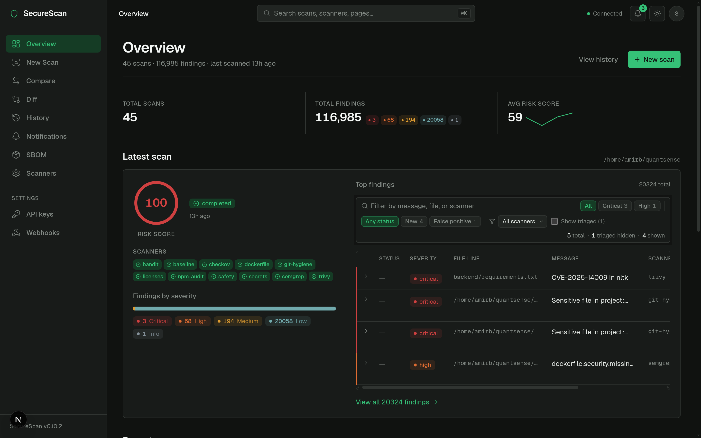
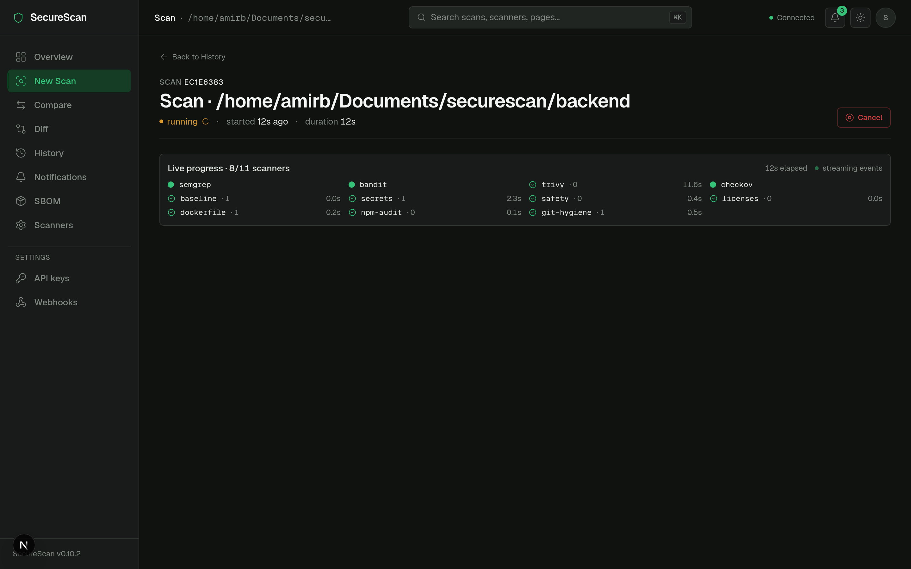
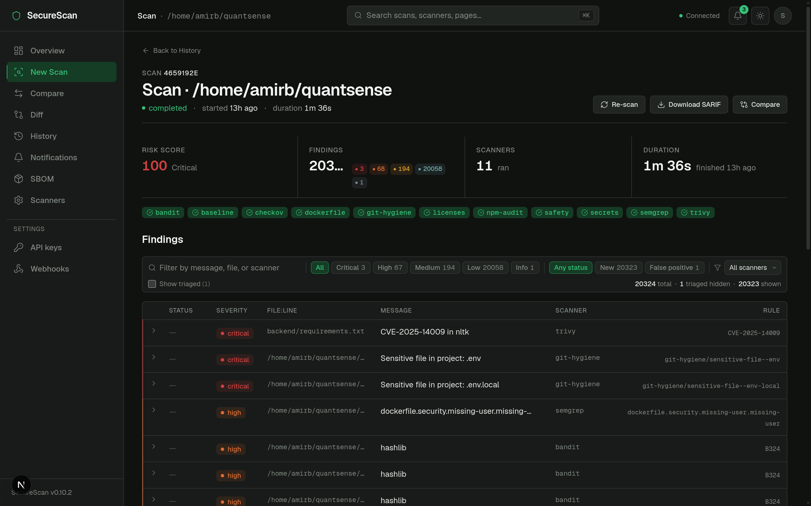
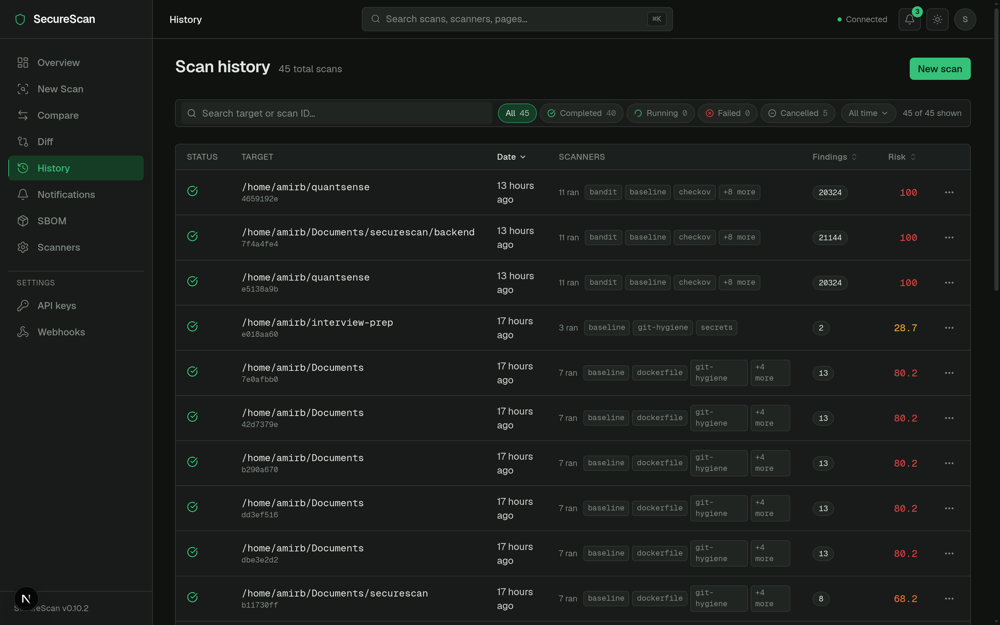
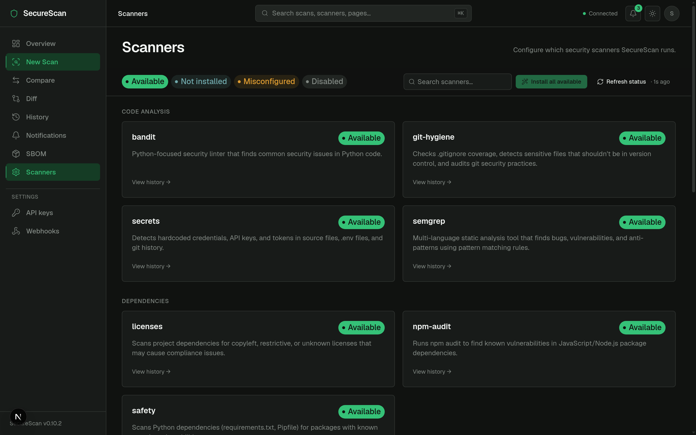

# SecureScan

> Diff-aware security scanning for CI/CD. Posts a single, upserting PR
> comment of NEW findings only — backed by 14 scanners, deterministic
> SARIF, and signed releases.

[](https://github.com/Metbcy/securescan/actions/workflows/container.yml)
[](https://github.com/Metbcy/securescan/actions/workflows/securescan.yml)
[](./LICENSE)

## Quick start (60 seconds)

```bash
# 1. Install
pip install securescan

# 2. Initialize
securescan init

# 3. Run
securescan diff . --base-ref origin/main --head-ref HEAD
```

That gives you a unified PR-comment-style report of NEW findings only. For the full dashboard, container, and CI integrations, see below.

## Dashboard

A self-hosted dashboard sits in front of every scan, finding, scanner,
SBOM, and webhook. The screenshots below are the live local
deployment scanning real targets (`~/quantsense`,
`~/securescan/backend`).

### Overview

Risk-score trend across all scans, the latest scan summary with its
top findings, and severity totals at a glance.



### Live scan progress

Every scan streams its lifecycle events over SSE — per-scanner state
(queued / running / complete / skipped / failed), per-scanner duration
and finding count, and elapsed wall-clock time, all in a single panel
that updates as the scan runs.



### Scan detail

Risk score, severity breakdown, all 11 scanners that ran, and a
findings table with severity + triage-status filters. Each finding
expands to show the rule, file, snippet, remediation, and per-finding
comment thread.



### History

Sortable, filterable list of every scan with the scanners that ran,
finding counts, and risk scores. Click a row for the full detail.



### Scanners

All 14 supported scanners with per-scanner availability, version, and
one-click install for the pip-installable ones. The "Refresh status"
control re-checks the host and shows when the last check ran.



## Why?

The most actionable security question on a PR is *"what changed in this
diff that I should worry about?"* — not *"what's in my repo right now?"*.
SecureScan answers the first question by classifying findings into
NEW / FIXED / UNCHANGED across the base ref and the head ref, then
posting only the NEW ones (with severity counts) as a single upserted
PR comment. Pre-existing legacy findings stay out of the way until you
choose to address them, so the tool can be left on across an org without
drowning every PR in noise.

Pair that with deterministic output (sorted findings, stable per-finding
fingerprints, no wall-clock timestamps) and the same comment can be
upserted on every push to the PR branch via a comment marker, the SARIF
re-uploads cleanly to GitHub's Security tab without false-new-alert
noise, and the renderer is byte-identical for the same inputs.

## Documentation

Full documentation: **https://metbcy.github.io/securescan/**

- [Quick start](https://metbcy.github.io/securescan/quick-start.html)
- [API reference](https://metbcy.github.io/securescan/api/overview.html)
- [Production checklist](https://metbcy.github.io/securescan/deployment/production-checklist.html)

## Install

There are three supported install paths. Pick the one that matches how
you want to run SecureScan.

### GitHub Action (recommended for CI)

The composite action wraps `securescan diff`, posts the upserted PR
comment, and uploads SARIF to the Security tab. It tries the wheel first
and falls back to the pinned container image when scanner binaries
aren't on `PATH`.

```yaml
# .github/workflows/securescan.yml
on: pull_request

permissions:
  contents: read
  pull-requests: write    # required for the upserted PR comment
  security-events: write  # required for SARIF upload to the Security tab

jobs:
  securescan:
    runs-on: ubuntu-latest
    steps:
      - uses: actions/checkout@v4
        with:
          fetch-depth: 0  # diff needs both base and head commits
      - uses: Metbcy/securescan@v1  # floating major; pin to @v0.11.0 for fully-deterministic CI
        with:
          scan-types: code,dependency
          fail-on-severity: high
```

The action's full input/output reference lives in
[`action/README.md`](./action/README.md).

### Action versioning

- `Metbcy/securescan@v1` — floating major. Auto-updates within v1.x. Recommended for most users.
- `Metbcy/securescan@v0.11.0` — exact pin. Use when you need fully deterministic CI.
- `:latest` is **not** published; pin a tag.

### Wheel from PyPI

```bash
pip install securescan                  # latest
pip install securescan==0.11.0          # exact pin
pip install 'securescan[pdf]'           # with PDF reports (pulls WeasyPrint)
```

The wheel only ships SecureScan itself. The underlying scanner CLIs
(`semgrep`, `bandit`, `safety`, `pip-licenses`, `checkov`, `trivy`,
`npm`, `nmap`, ZAP, …) need to be installed separately and on `PATH` for
the scanners that wrap them to run. Use `securescan status` to see what
is detected. If you don't want to manage scanner installs yourself, use
the container.

### Container (`ghcr.io/metbcy/securescan`)

The image is multi-arch (amd64 + arm64), comes with all 14 scanners
pre-installed at pinned versions, and is what the GitHub Action falls
back to when wheel-mode prerequisites aren't met.

```bash
docker run --rm -v "$PWD:/work" -w /work \
  ghcr.io/metbcy/securescan:v0.11.0 \
  diff . --base-ref origin/main --head-ref HEAD \
         --output github-pr-comment
```

## Usage

```bash
# Diff a PR locally (refs must exist in the local clone)
securescan diff . --base-ref main --head-ref HEAD

# CI snapshot path (skip git checkouts; consume two pre-scanned JSONs)
securescan diff . \
  --base-snapshot before.json \
  --head-snapshot after.json \
  --output github-pr-comment

# Full one-shot scan (legacy v0.1.0 mode — still supported)
securescan scan ./your-project \
  --type code --type dependency \
  --output sarif --output-file results.sarif

# Refresh the baseline JSON used to suppress legacy findings
securescan scan . --output json --output-file baseline.json
```

`securescan diff` accepts either ref mode (`--base-ref` / `--head-ref`)
**or** snapshot mode (`--base-snapshot` / `--head-snapshot`), never
both. Snapshot mode is the recommended CI path: each side runs
`securescan scan ... --output json` independently, then a single
classification step does the diff without re-checking-out the tree.

In CI, AI enrichment is auto-disabled when the `CI=true` environment
variable is set; pass `--ai` to force it on or `--no-ai` to be explicit.

## Configuration

SecureScan reads `.securescan.yml` from the project root (it walks up
from `securescan diff`'s target directory until it finds one or hits a
`.git/` boundary). The config is fully optional; without it, v0.2.0
behavior is preserved.

```yaml
# .securescan.yml — full schema reference. Every key is optional.

# Default scan types when --type is not passed on the CLI.
scan_types:
  - code
  - dependency

# Per-rule severity overrides. Keys are scanner rule IDs as they appear
# in `rule_id` on the JSON output. Useful when a rule fires too high or
# too low for your codebase. The original severity is preserved on
# `metadata.original_severity` so the audit trail is intact.
severity_overrides:
  python.lang.security.audit.dangerous-system-call: medium
  python.lang.security.audit.eval-detected: low

# Globally ignored rules. Findings with these rule_ids are filtered out
# of CI output (PR comments, SARIF) but still visible locally with
# --show-suppressed.
ignored_rules:
  - python.lang.security.audit.dynamic-django-attribute
  - B106  # bandit: hardcoded password (we use a vault)

# Custom Semgrep rule packs. Paths are relative to this config file's
# directory. When non-empty, replaces `semgrep --config auto`.
semgrep_rules:
  - .securescan/rules/secrets.yml
  - .securescan/rules/unsafe-deserialization.yml

# Default fail-on-severity threshold (overridden by CLI --fail-on-severity).
fail_on_severity: high

# AI enrichment. true forces on, false forces off; omitted lets CLI / CI
# default decide (off in CI, on locally).
ai: false
```

Validate the file with `securescan config validate` to catch typos and
missing rule-pack paths before they bite at scan time.

## Suppressing findings

When a finding is wrong for your codebase — a known false positive, a
deliberate use of a flagged pattern, an issue you've accepted — there
are three ways to suppress it. Precedence is **inline > config > baseline**.

### 1. Inline ignore comments (closest to the code)

Add a comment on the line a finding fires for, or the line above:

```python
data = eval(payload)  # securescan: ignore python.lang.security.audit.eval-detected

# securescan: ignore-next-line python.lang.security.audit.eval-detected
result = eval(other_payload)
```

Recognized comment styles: `#`, `//`, `--`. Multiple rule IDs are
comma-separated. `*` is a wildcard.

### 2. Config-driven `ignored_rules` (repo-wide)

`.securescan.yml`:

```yaml
ignored_rules:
  - python.lang.security.audit.eval-detected
```

### 3. Baseline (legacy findings)

When you adopt SecureScan on an existing codebase, run
`securescan baseline` once to checkpoint everything that's there now.
Subsequent scans pass `--baseline .securescan/baseline.json` (or set
the path in CI); only NEW findings appear in PR comments.

```bash
securescan baseline > /dev/null   # writes to .securescan/baseline.json
securescan diff . --base-ref main --head-ref HEAD --baseline .securescan/baseline.json
```

Refresh the baseline whenever findings get fixed (so they show up in
`securescan compare` as drift):

```bash
securescan baseline   # overwrites .securescan/baseline.json
securescan compare .securescan/baseline.json   # what disappeared since the last baseline?
```

### Audit: what was suppressed?

By default, suppressed findings are hidden from CI output. Locally,
`securescan diff` (and `scan` and `compare`) on a TTY show them with a
`[SUPPRESSED:<reason>]` prefix so you can see what's hidden during
review. Force visibility everywhere with `--show-suppressed`. Disable
suppression entirely (kill switch) with `--no-suppress`.

## Inline PR review comments

When `pr-mode: inline` is set on the `Metbcy/securescan@v1` action, SecureScan posts findings as a single GitHub Review with one inline comment anchored on each affected line — instead of a single summary comment in the PR thread.

Reviewers can resolve each finding individually; replies preserve threads across re-runs because each comment is keyed by a stable per-finding fingerprint.

```yaml
# .github/workflows/security.yml
- uses: Metbcy/securescan@v1
  with:
    pr-mode: inline           # was: summary (default; backward-compatible)
    review-event: COMMENT     # COMMENT | REQUEST_CHANGES | APPROVE
    inline-suggestions: true  # one-click `# securescan: ignore RULE` suggestion
```

### How it works

1. **Diff resolution**: SecureScan reads `git diff <base>..<head>` to compute each finding's *position* — GitHub's offset-into-the-PR-diff coordinate, not the source line number.
2. **Findings outside the diff fall back to the review body** so they're not silently dropped.
3. **Suggestion blocks** (when `inline-suggestions: true`):
   - For findings the reviewer can suppress, SecureScan offers a one-click `\`\`\`suggestion` block adding `# securescan: ignore <rule_id>` above the line.
   - For findings whose severity is wrong for this codebase, SecureScan shows a copy-paste `severity_overrides:` snippet for `.securescan.yml`.
4. **Idempotent re-runs**: each comment carries a hidden `<!-- securescan:fp:<prefix> -->` marker. On re-runs, SecureScan PATCHes existing comments instead of posting duplicates — reviewer reply threads survive.
5. **Resolved findings are marked**, not deleted: when a finding disappears from a re-run, its comment is patched to `**Resolved in <sha7>** — ...` with the original body strikethrough'd. Manual resolution by the reviewer is honored (we don't auto-resolve threads).

### Local development

To inspect what would be posted without running CI:

```bash
securescan diff . --base-ref main --head-ref HEAD \
  --output github-review --repo Metbcy/securescan \
  --output-file review.json
cat review.json | jq .
```

The CLI requires `--repo`, `--sha`, and `--base-sha` (auto-resolved from `--base-ref`/`--head-ref` in a git working tree). It does NOT post to GitHub on its own — that's the Action's job.

### Permissions

```yaml
permissions:
  contents: read
  pull-requests: write   # covers BOTH summary comment AND inline review submission
  security-events: write # for SARIF upload (unrelated; only if you also enable SARIF)
```

### Compared to `pr-mode: summary`

| | summary (default) | inline | both |
|---|---|---|---|
| Comment count | 1 (upserted) | 1 review with N inline comments | summary + inline |
| Reviewer can resolve per-finding | No | Yes | Yes (inline) |
| Findings on touched code only | All | Only lines in PR's diff | summary covers all |
| Findings outside touched code | In the comment | Review body fallback | covered both ways |
| Suggestion blocks | No | Yes (when enabled) | Yes (inline only) |

`summary` remains the v0.2.0/v0.3.0 default. `inline` is opt-in. `both` works for teams that want a summary on the conversation tab AND inline anchors on the files-changed tab.

## Production deployment

For local development the dashboard runs unauthenticated against an
unsecured API. Production deployments need three things from
v0.5.0:

### 1. API key auth

Set `SECURESCAN_API_KEY` to a strong random string before starting
the FastAPI server:

```bash
export SECURESCAN_API_KEY="$(openssl rand -hex 32)"
uvicorn securescan.main:app --host 0.0.0.0 --port 8000
```

When the env var is set, every `/api/*` endpoint requires the header
`X-API-Key: <key>` (or `Authorization: Bearer <key>` for tooling that
prefers Bearer auth). `/health` and `/ready` remain public for
Kubernetes / load-balancer probes.

When `SECURESCAN_API_KEY` is unset, the server logs a clear warning
at startup (`SECURESCAN_API_KEY not set; API is unauthenticated
(dev mode).`) and serves all routes without auth — the v0.4.0
behavior preserved for zero-config local dev.

For the dashboard frontend, set
`NEXT_PUBLIC_SECURESCAN_API_KEY` at build/deploy time so all client
requests carry the header automatically.

### 2. Structured logging

JSON logs by default in containers (the bundled Dockerfile sets
`SECURESCAN_IN_CONTAINER=1`). Override with:

```bash
export SECURESCAN_LOG_FORMAT=json    # or "text"
export SECURESCAN_LOG_LEVEL=INFO     # DEBUG | INFO | WARNING | ERROR
```

Each request emits one structured log entry with `request_id`,
`method`, `path`, `status`, and `latency_ms` so log aggregators
correlate per-request lifecycles. Clients can pin a request_id by
sending `X-Request-ID: <uuid>`; otherwise the server generates one
and echoes it back via the same header.

### 3. Health and readiness probes

| Endpoint | Purpose | When to hit |
|---|---|---|
| `GET /health` | Liveness — process up. Always 200 unless the process is crashing. | Kubernetes `livenessProbe`, simple uptime checks. |
| `GET /ready` | Readiness — DB openable, scanner registry loaded. Returns 200 with checks JSON when ready, 503 with details when not. | Kubernetes `readinessProbe`, ALB target-group health checks, rolling-update gates. |

Example Kubernetes deployment fragment:

```yaml
livenessProbe:
  httpGet: { path: /health, port: 8000 }
  initialDelaySeconds: 5
  periodSeconds: 10
readinessProbe:
  httpGet: { path: /ready, port: 8000 }
  initialDelaySeconds: 2
  periodSeconds: 5
```

### 4. Reverse proxy / TLS

The bundled uvicorn entrypoint serves plain HTTP. Production
deployments should sit behind a TLS-terminating proxy (nginx,
Traefik, AWS ALB, Caddy, etc.) and forward `X-Request-ID` headers
through so client correlation works end-to-end.

### 5. Rate limiting

`POST /api/scans` (and the forward-compatible `POST /api/v1/scans`
mount) is rate-limited with an in-memory token bucket so a single
client can't flood the orchestrator with expensive scan jobs. Read
endpoints (list scans, get findings, dashboard, sbom) are not
rate-limited — they are cheap and benefit from being responsive
during incident triage.

Defaults: **60 requests / minute** with a **burst of 10**, per API
key (or per client IP when `SECURESCAN_API_KEY` is unset). Override
with environment variables:

```bash
export SECURESCAN_RATE_LIMIT_PER_MIN=60     # sustained rate
export SECURESCAN_RATE_LIMIT_BURST=10       # burst capacity
export SECURESCAN_RATE_LIMIT_ENABLED=true   # set to false to disable
```

Every rate-limited response carries `X-RateLimit-Limit`,
`X-RateLimit-Remaining`, and `X-RateLimit-Reset` (unix-ts) so
clients can back off cleanly. When the bucket is empty the server
returns HTTP `429` with a `Retry-After` header and a structured
JSON body:

```json
{ "detail": "Rate limit exceeded", "retry_after": 7, "limit_per_min": 60 }
```

The bucket store is bounded (max 10K live keys, 1h idle TTL with
LRU eviction) so a key-rotation or DoS pattern can't grow memory
without limit.

### 6. Real-time scan progress (SSE) — single-worker only

`GET /api/v1/scans/{scan_id}/events` (and the legacy `/api/scans/...`
alias) emits a Server-Sent Events stream of lifecycle events
(`scan.start`, `scanner.start`, `scanner.complete`, `scanner.skipped`,
`scanner.failed`, `scan.complete`, `scan.failed`, `scan.cancelled`)
so the dashboard can show live progress without polling. Late
subscribers get a 30 second replay buffer so a tab refresh during
the closing seconds of a scan still receives the full event sequence
and the terminal event.

> ⚠️ **Run uvicorn with a single worker** (`--workers 1`, the default).
> The pub/sub bus is in-process: a `POST /api/v1/scans` that lands on
> worker A and a `GET /api/v1/scans/{id}/events` that lands on worker B
> will never see each other. Multi-process backplanes (Redis pubsub)
> are a future feature. If you need to scale horizontally today, scale
> by running multiple separate single-worker instances behind a
> sticky-session load balancer keyed on `scan_id`, or fall back to
> polling `GET /api/v1/scans/{id}` every couple of seconds.

## Subcommands

| Command | What it does |
|---|---|
| `securescan scan <path>` | Full scan of a directory. Outputs findings in any format. |
| `securescan diff <path> --base-ref <sha> --head-ref <sha>` | Diff-aware scan: only NEW findings introduced since the base ref. |
| `securescan compare <path> <baseline.json>` | Compare current scan against a saved baseline; report drift (what disappeared). |
| `securescan baseline [-o <path>]` | Write a canonical baseline JSON of current findings (deterministic; checkable into git). |
| `securescan config validate [<path>]` | Lint `.securescan.yml` for typos, bad severities, missing rule-pack paths. |
| `securescan history` | List past saved scans. |
| `securescan status` | List which scanners are installed and reachable. |
| `securescan serve` | Run the FastAPI dashboard backend. |

## Output formats

| Format | Use case |
|---|---|
| `github-pr-comment` (default for `diff`) | PR upsert via the `<!-- securescan:diff -->` marker — one comment per PR, updated in place on every push |
| `sarif` | GitHub Code Scanning / Security tab; emits `partialFingerprints` so re-uploads dedup cleanly |
| `json` | Downstream tooling, baselines, snapshot-mode diff inputs, debugging |
| `text` | Human-readable terminal output (default for `diff` on a TTY when no `--output` given) |

## Determinism

Every renderer produces byte-identical output for the same inputs:

- Findings are sorted by a canonical key (severity, scanner, rule id,
  file path, line number).
- Each finding gets a stable fingerprint
  `sha256(scanner | rule_id | file_path | normalized_line_context | cwe)`
  so trivial whitespace or line shifts don't reclassify it as new.
- No wall-clock timestamps in any output payload — set
  `SECURESCAN_FAKE_NOW` in tests or CI replays to pin the only
  time-derived field that exists.
- Rule lists in SARIF are deduplicated and ordered.

The PR-comment upsert and the SARIF Security-tab dedup both rely on
this — non-deterministic output silently breaks the "single comment per
PR" property.

## Scanners

| Scanner | Type | What it finds |
|---------|------|--------------|
| **Semgrep** | Code (SAST) | SQL injection, XSS, hardcoded secrets, command injection |
| **Bandit** | Code (Python) | Python-specific security issues, insecure imports |
| **Secrets** | Code | Hardcoded credentials, API keys, tokens, private keys |
| **Git Hygiene** | Code | Sensitive files in repo, missing `.gitignore` protections |
| **Trivy** | Dependencies | Known CVEs in package manifests and lockfiles |
| **Safety** | Dependencies | Python dependency vulnerabilities from safety DB |
| **License Checker** | Dependencies | Copyleft / unknown license compliance risks |
| **npm Audit** | Dependencies | npm package advisories and transitive vulns |
| **Checkov** | IaC | Terraform, K8s, Docker, and cloud misconfigurations |
| **Dockerfile** | IaC | Insecure Docker patterns (`:latest`, root user, `curl \| sh`, secrets in `ENV`) |
| **Baseline** | System Config | SSH, firewall, password policy, kernel security checks |
| **DAST Built-in** | DAST | Missing security headers, information disclosure, insecure cookie flags |
| **OWASP ZAP** | DAST | Web app vulnerabilities via ZAP active/passive scanning |
| **Nmap** | Network | Open ports, service detection, risk classification |

Use `--type code --type dependency` (etc.) to limit a run to a category;
the default for `securescan diff` is `code` for fast PR feedback.

## AI enrichment (optional)

Set a Groq API key (free tier) to enable AI-powered remediation
suggestions, executive summaries, and contextual risk analysis:

```bash
export SECURESCAN_GROQ_API_KEY=your-key-here
```

AI enrichment is **off by default in CI** (auto-disabled when `CI=true`
is set, regardless of API key) because it is non-deterministic and would
break the comment-upsert / SARIF-dedup invariants. Use `--no-ai` to be
explicit, or `--ai` to force enrichment back on in a CI run that has
opted out of those invariants.

## Dashboard (secondary surface)

The original v0.1.0 dashboard still works unchanged: a FastAPI backend
in [`backend/securescan/main.py`](./backend/securescan/main.py) and a
Next.js frontend in [`frontend/`](./frontend). It is the right surface
when you want to browse historical scans, inspect findings interactively,
or pick scan targets via a UI rather than a CLI flag. The v0.2.0 wedge
is the GitHub Action; the dashboard is now positioned as a complementary
local / internal tool, not the primary entry point.

Quick start:

```bash
# Backend (FastAPI on :8000)
cd backend
python3 -m venv venv && source venv/bin/activate
pip install -e .
pip install semgrep bandit safety pip-licenses checkov
securescan serve --host 127.0.0.1 --port 8000

# Frontend (Next.js on :3000), in a second shell
cd frontend
npm install
npm run dev

# All-in-one
docker compose up
```

Open http://localhost:3000 — it talks to the backend at
http://localhost:8000.

## Local config

SecureScan loads `~/.config/securescan/.env` at startup. Use it to persist credentials between reboots:

    # ~/.config/securescan/.env
    SECURESCAN_ZAP_ADDRESS=http://127.0.0.1:8090
    SECURESCAN_ZAP_API_KEY=your-key-here

Shell environment vars take precedence over this file.

## Release signing

Every tagged release publishes signed artifacts. The exact verification
commands are appended to each GitHub Release's notes by
[`.github/workflows/release.yml`](./.github/workflows/release.yml); the
templates are reproduced here for `<tag>` (e.g. `v0.2.0`) and
`<version>` (e.g. `0.2.0`):

### Wheel + sdist (sigstore-python)

```bash
pip install sigstore
sigstore verify identity \
  --cert-identity 'https://github.com/Metbcy/securescan/.github/workflows/release.yml@refs/tags/<tag>' \
  --cert-oidc-issuer https://token.actions.githubusercontent.com \
  securescan-<version>-py3-none-any.whl
```

The matching `*.sigstore.json` bundles ship as GitHub Release assets
alongside the wheel.

### Container image (cosign keyless)

```bash
cosign verify \
  --certificate-identity 'https://github.com/Metbcy/securescan/.github/workflows/release.yml@refs/tags/<tag>' \
  --certificate-oidc-issuer https://token.actions.githubusercontent.com \
  ghcr.io/metbcy/securescan:<tag>
```

Both identities are pinned to `refs/tags/<tag>` — that is why the
release workflow is tag-triggered only and does not offer
`workflow_dispatch` (a manual run would publish under a `refs/heads/...`
identity and break these verification commands).

### Pinning the GitHub Action

`Metbcy/securescan@v1` is the floating major-version tag — it
auto-tracks the latest `v1.x.y` stable release and is the recommended
pin for most users. `Metbcy/securescan@v0.11.0` (or any specific
`vX.Y.Z`) is the immutable per-release pin — use it when you want
reproducible CI behaviour and explicit upgrades. `:latest` is **not**
published; pin to a tag.

## Non-goals

SecureScan deliberately does **not** try to be:

- An SBOM generator (use Syft / cyclonedx-cli).
- A dependency-tree visualiser.
- A drop-in replacement for a full SCA platform (Snyk, Dependabot, etc).
  SecureScan orchestrates open-source scanners and adds diff-awareness;
  it does not maintain its own vulnerability database.
- A vulnerability database in its own right.

The wedge is *"diff-aware PR comments + SARIF + signed releases, on top
of scanners you already trust"*, not *"reinvent the security toolchain"*.

## Reference

<details>
<summary>v0.1.0 dashboard / API endpoints (still available)</summary>

| Method | Endpoint | Description |
|--------|----------|-------------|
| GET | `/` | API info with links to docs and health |
| GET | `/health` | Simple health check |
| POST | `/api/scans` | Start a new scan |
| GET | `/api/scans` | List all scans |
| GET | `/api/scans/{id}` | Get scan details |
| GET | `/api/scans/{id}/findings` | Get scan findings |
| GET | `/api/scans/{id}/summary` | Get scan summary |
| POST | `/api/scans/{id}/cancel` | Cancel an active scan |
| GET | `/api/scans/compare` | Compare two scans (new, fixed, unchanged) |
| GET | `/api/dashboard/status` | Scanner availability |
| GET | `/api/dashboard/stats` | Aggregate statistics |
| GET | `/api/dashboard/trends` | Risk / findings trend data |
| GET | `/api/browse` | Filesystem directory picker data |
| POST | `/api/dashboard/install/{scanner}` | Install supported scanners |

</details>

<details>
<summary>Running tests</summary>

```bash
cd backend
source venv/bin/activate
pytest tests/ -v
```

</details>

<details>
<summary>Tech stack</summary>

- **Backend**: Python, FastAPI, SQLite, asyncio, Typer
- **Frontend**: Next.js 15, Tailwind CSS, Recharts
- **CI / release**: GitHub Actions, sigstore-python, cosign
- **AI**: Groq API (Llama 3) — optional, off in CI
- **Scanners**: 14 integrated scanners (code, dependency, IaC, DAST, network, baseline)

</details>

## License

MIT — see [`LICENSE`](./LICENSE).
