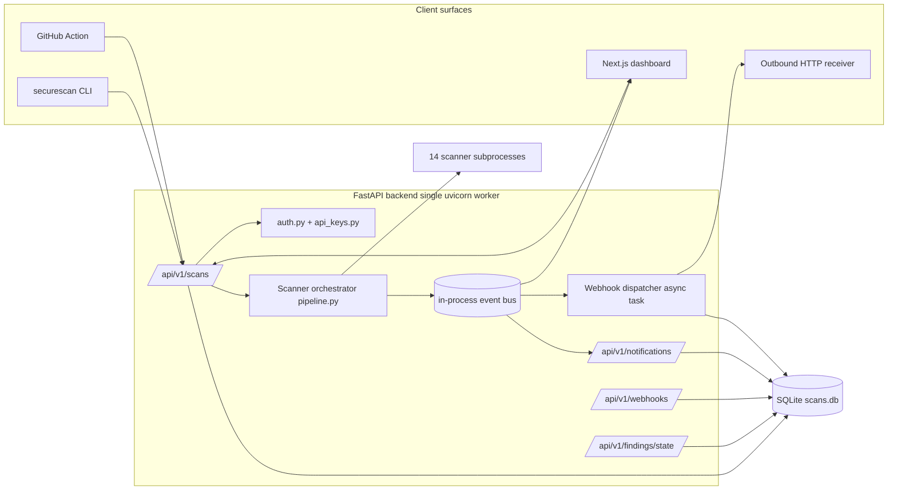
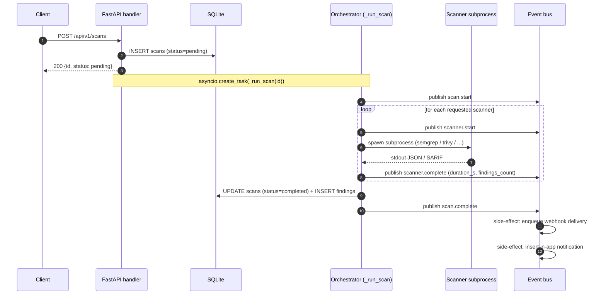
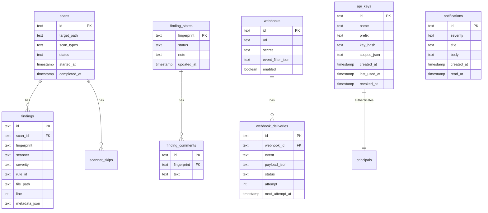
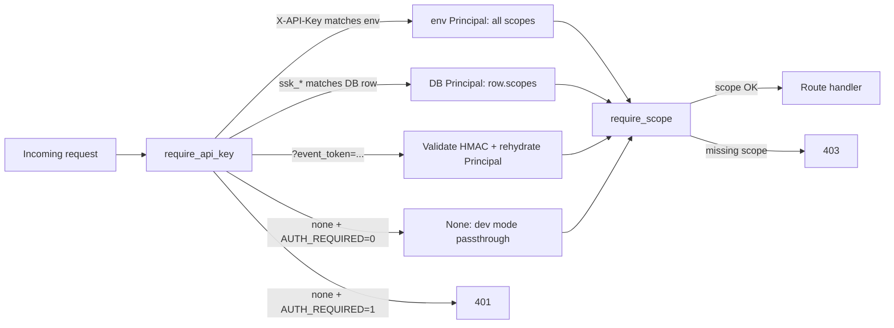

# Architecture overview

SecureScan is three pieces that talk over a stable JSON API:

- A **FastAPI backend** that schedules scanner subprocesses, persists
  findings to SQLite, and exposes the REST API.
- A **Next.js dashboard** that consumes that API.
- A **CLI / GitHub Action** that runs scans either directly or against
  a backend over HTTP.

Everything centers on the **finding**: a normalized record produced by
one of the 14 scanners, deduplicated across scanners, fingerprinted for
cross-scan identity, and serialized deterministically.

<!-- toc -->

## Component diagram



## Scan lifecycle

`POST /api/v1/scans` returns immediately with a `pending` scan row.
The scanners run as a background asyncio task on the same uvicorn
worker; the request handler does not block on them.



Every event in this flow is published to the in-process
[event bus](./dashboard/realtime.md), which fans out to:

1. The dashboard's SSE subscribers (live progress).
2. The outbound webhook dispatcher
   ([webhook_dispatcher.py](https://github.com/Metbcy/securescan/blob/main/backend/securescan/webhook_dispatcher.py)).
3. The notifications table (bell-icon in-app feed).

## Data model



The cross-cutting identity in this schema is the **fingerprint**: a
SHA-256 over `(scanner, rule_id, file_path, normalized_line_context, cwe)`
that stays stable across scans of the same target. Triage state and
comments are keyed on the fingerprint, not the scan id, which is why
deleting a scan does not lose the verdict — see
[Triage workflow](./scanning/triage.md) for the full story.

## Authentication topology



See [Authentication overview](./auth/overview.md) for the full path
through `auth.py`, including event-token auth on the SSE route.

## Process boundaries

| Process                    | Responsibility                                                       | Restart safe?                                       |
| -------------------------- | -------------------------------------------------------------------- | --------------------------------------------------- |
| `uvicorn` worker (single)  | Serve API, run orchestrator, dispatch webhooks, drive event bus.     | Yes — pending webhook deliveries resume from DB.    |
| Scanner subprocesses       | One per scanner per scan, spawned by the orchestrator.               | Killed when scan is cancelled (`POST /cancel`).     |
| Frontend (Next.js)         | Pure read/write client of the API. Stateless.                        | Yes — page reload re-subscribes the SSE stream.     |

```admonish warning title="Single worker constraint"
The event bus and the webhook dispatcher are both **in-process**
singletons. Run uvicorn with `--workers 1`. To scale horizontally
today, run multiple separate single-worker instances behind a
sticky-session load balancer keyed on `scan_id`. Multi-process pubsub
(Redis backplane) is on the roadmap.
See [Single-worker constraint](./deployment/single-worker.md).
```

## Determinism contract

For the diff-aware PR comment and the SARIF Security-tab dedup to
work, the renderer must produce **byte-identical output** for the
same inputs. SecureScan enforces this by:

1. Sorting findings by a canonical key
   `(severity_rank desc, scanner, rule_id, file_path, line, title)`.
2. Excluding wall-clock timestamps from byte-identity-sensitive
   sections. `SECURESCAN_FAKE_NOW` pins the only time-derived field.
3. Deduplicating + ordering rule lists in SARIF.
4. Computing each finding's
   `partialFingerprints.primaryLocationLineHash` from the stable
   per-finding fingerprint.
5. Auto-disabling AI enrichment when `CI=true` (it is
   non-deterministic).

Without these properties, every PR push would post a *new* PR comment
instead of upserting the existing one, and SARIF re-uploads would
look like a wave of new alerts. See
[Findings & severity](./scanning/findings-severity.md) for the
fingerprint construction.

## Source layout

| Directory                                          | Contents                                                            |
| -------------------------------------------------- | ------------------------------------------------------------------- |
| `backend/securescan/api/`                          | FastAPI routers (scans, triage, webhooks, notifications, keys, …). |
| `backend/securescan/scanners/`                     | One module per scanner; all subclass `BaseScanner`.                 |
| `backend/securescan/auth.py`                       | `Principal`, `require_api_key`, `require_scope`.                    |
| `backend/securescan/api_keys.py`                   | Key generation + salted-SHA-256 hashing.                            |
| `backend/securescan/event_tokens.py`               | SSE event-token mint/verify.                                        |
| `backend/securescan/webhook_dispatcher.py`         | Durable webhook delivery worker.                                    |
| `backend/securescan/pipeline.py`                   | The scan orchestrator (`_run_scan` lives in `api/scans.py`).        |
| `backend/securescan/fingerprint.py`                | Cross-scan finding identity.                                        |
| `backend/securescan/dedup.py`                      | Cross-scanner deduplication.                                        |
| `backend/securescan/scoring.py`                    | Risk-score formula (severity rank × scanner confidence).            |
| `frontend/src/app/`                                | Next.js app router pages — see [Dashboard tour](./dashboard/tour.md). |
| `action/`                                          | The composite GitHub Action.                                        |

## Next

- Run a scan from scratch: [Quick start](./quick-start.md).
- Operate it past `localhost`: [Production checklist](./deployment/production-checklist.md).
- Wire it into CI: [GitHub Action](./cli/github-action.md).
