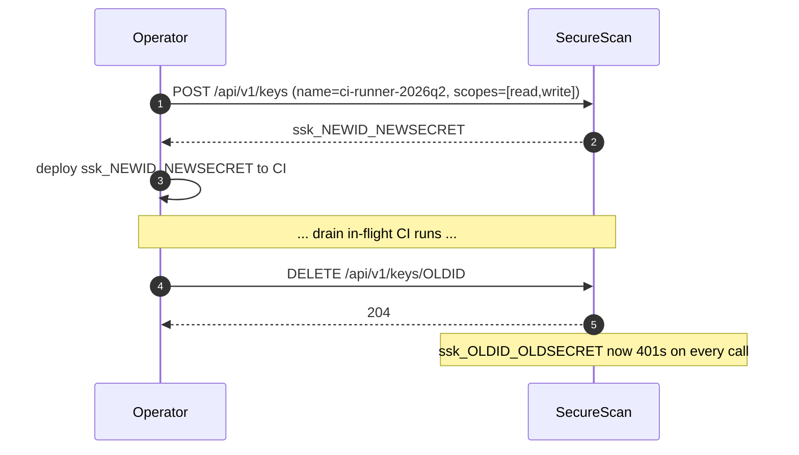

# API keys

Hashed, scoped, DB-issued API keys — introduced in v0.8.0. Replaces
the v0.5.0 single-shared-env-var contract for production deployments.
The legacy env var still works as a break-glass / dev-mode fallback.

<!-- toc -->

## Format

```text
ssk_<10-char-id>_<32-char-secret>
```

- **Prefix** `ssk_` — fixed; lets the auth path quickly reject
  obviously-malformed keys without a DB roundtrip.
- **id** — 10 base64url chars, ~60 bits of entropy. The id is what
  surfaces in API responses (the `id` field on `ApiKeyView`) and what
  the dashboard shows as the key's stable identifier.
- **secret** — 32 base64url chars, ~192 bits of entropy. Combined with
  the id, total ≈ 250 bits — brute-forcing is infeasible without a
  memory-hard KDF.

Example: `ssk_5a7c8f9eab_abcdefghij1234567890klmnopqrstuv`.

The DB only ever stores a salted SHA-256 hash. The plaintext is
returned **exactly once** at creation. Lose it → revoke and re-issue.

## Why salted SHA-256, not bcrypt / argon2?

```admonish note title="Design choice"
The keys are 192-bit random secrets. Brute-forcing the hash is
already infeasible without a memory-hard KDF. Adding bcrypt buys
nothing except a hard dependency and per-request CPU cost on the
hot auth path. The hash is `<salt-hex>$<sha256-hex>` so it's
self-contained — no separate salt column, no runtime config knob.
This is the rationale documented in
[`backend/securescan/api_keys.py`](https://github.com/Metbcy/securescan/blob/main/backend/securescan/api_keys.py).
```

If your threat model is different (e.g. you let users pick weak
keys), use longer keys, not a slower KDF. The strength is in the
secret, not the hash.

## Issuing a key

### Via the API (curl)

```bash
$ curl -s -X POST http://127.0.0.1:8000/api/v1/keys \
    -H "X-API-Key: $ADMIN_KEY" \
    -H 'Content-Type: application/json' \
    -d '{
      "name": "ci-runner",
      "scopes": ["read", "write"]
    }' | jq .
{
  "id": "5a7c8f9eab",
  "name": "ci-runner",
  "prefix": "ssk_5a7c8f9eab",
  "scopes": ["read", "write"],
  "created_at": "2026-04-29T20:00:00",
  "last_used_at": null,
  "revoked_at": null,
  "key": "ssk_5a7c8f9eab_abcdefghij1234567890klmnopqrstuv"
}
```

```admonish important title="The plaintext key is in the response, ONCE"
Save the `key` field immediately — write it to a secrets manager,
inject it into a CI environment, whatever your workflow is. **The
secret is never returned again.** Subsequent reads strip it.
```

### Via the dashboard

The `/settings/keys` page lists existing keys (name, prefix, scopes,
created, last used, status) and has a **New key** modal:

1. Click "New key".
2. Fill in name + scopes.
3. Modal shows the secret with a copy button. Close button is
   disabled for **1 second** to prevent reflexively dismissing.
4. Closing without an explicit "I saved it" confirmation triggers a
   "discard without saving the key?" dialog (Esc / outside-click).
5. Once closed, the secret is gone from memory. The list-row updates.

Source: `frontend/src/app/settings/keys/page.tsx`.

## Default scopes

```admonish tip
A new-key request without an explicit `scopes` list defaults to
`["read", "write"]`. **`admin` is never granted by default** — you
have to ask for it. This matches the principle of least privilege
and means the common case (a CI runner that posts scans and reads
results) is handled without thinking about permissions.
```

See [Scopes](./scopes.md) for what each scope grants.

## Listing & introspection

```bash
# List all keys (admin only)
curl -H "X-API-Key: $ADMIN_KEY" http://127.0.0.1:8000/api/v1/keys

# Introspect the calling key (any DB key)
curl -H "X-API-Key: $K" http://127.0.0.1:8000/api/v1/keys/me
```

`GET /me` is useful from a CI step to confirm the right key is
plumbed in:

```bash
$ curl -s -H "X-API-Key: $K" http://127.0.0.1:8000/api/v1/keys/me | jq .
{
  "id": "5a7c8f9eab",
  "name": "ci-runner",
  "prefix": "ssk_5a7c8f9eab",
  "scopes": ["read", "write"],
  "created_at": "2026-04-29T20:00:00",
  "last_used_at": "2026-04-29T20:14:22",
  "revoked_at": null
}
```

## Revoking a key

```bash
curl -X DELETE -H "X-API-Key: $ADMIN_KEY" \
  http://127.0.0.1:8000/api/v1/keys/5a7c8f9eab
# 204 — revocation is recorded with revoked_at = now
```

A revoked key is **never** un-revoked. To rotate, create a new key
and revoke the old one.

A second `DELETE` on the same id is a no-op 204 (idempotent: the
caller's intent — "this id should be revoked" — is satisfied).

## Lockout protection

Revoking the *last unrevoked admin key* when `AUTH_REQUIRED=1` and no
`SECURESCAN_API_KEY` env var is set returns:

```http
HTTP/1.1 409 Conflict
Content-Type: application/json

{"detail": "Cannot revoke last admin key without an env-var fallback"}
```

The check is in `count_admin_keys_active`. The point: you cannot lock
yourself out of your own deployment via the API. To intentionally
revoke the last admin key, either:

1. Set `SECURESCAN_API_KEY` first (so an env-var fallback exists), then revoke; OR
2. Issue a replacement admin key first, then revoke the original.

If `AUTH_REQUIRED=0` (or the env var is set), revoking the last admin
key is allowed — the system will fall back to env-var auth or, with
neither, dev mode.

## Lifecycle: rotate a key



The rotation is fast (no proxying period) because both keys are
valid in parallel until the old one is revoked. There is no caching
in the auth path beyond `last_used_at`.

## Migration from v0.8.0 env-var-only

If you are running v0.7.0 or earlier and want to move to DB-backed
keys, the path is:

```mermaid
flowchart LR
  Start([env-var only<br>SECURESCAN_API_KEY set]) --> A[Upgrade to v0.8.0+]
  A --> B[Backend boots; env-var path still works]
  B --> C[Issue an admin DB key:<br>POST /api/v1/keys with scopes=admin]
  C --> D[Test the new admin key against /keys/me]
  D --> E[Issue scoped keys for CI/dashboard:<br>POST /api/v1/keys]
  E --> F[Update CI/dashboard to the new key]
  F --> G[Set AUTH_REQUIRED=1 + EVENT_TOKEN_SECRET]
  G --> H[Restart backend]
  H --> I([Optional: unset SECURESCAN_API_KEY<br>now that DB keys carry the system])
```



```admonish warning
Don't unset `SECURESCAN_API_KEY` until you have verified at least
one **admin** DB key works. If you remove the env var and your only
DB keys are read/write, you've locked yourself out of issuing more
keys. Lockout protection on `DELETE /keys/{id}` catches the symmetric
case but not "operator removed the env var manually."
```

## DB schema

```sql
CREATE TABLE api_keys (
  id            TEXT PRIMARY KEY,
  name          TEXT NOT NULL,
  prefix        TEXT NOT NULL,                  -- ssk_<id> + 1 char of secret; safe to display
  key_hash      TEXT NOT NULL,                  -- "<salt-hex>$<sha256-hex>"
  scopes        TEXT NOT NULL,                  -- JSON array of scope strings
  created_at    TEXT NOT NULL,
  last_used_at  TEXT,                           -- updated on each successful auth
  revoked_at    TEXT                            -- non-null = revoked
);
```

A revoked key is kept (not deleted) so the audit trail records who
created it and when it was revoked.

## API reference

| Method   | Path                            | Scope    | Body / Notes                                                                              |
| -------- | ------------------------------- | :------: | ----------------------------------------------------------------------------------------- |
| `POST`   | `/api/v1/keys`                  | `admin`  | `{name, scopes?}` → 201 `ApiKeyCreated` (the only response that includes the full secret) |
| `GET`    | `/api/v1/keys`                  | `admin`  | `ApiKeyView[]` — no secret                                                                |
| `GET`    | `/api/v1/keys/me`               | any DB key | `ApiKeyView` of the caller; useful for CI sanity checks                                |
| `DELETE` | `/api/v1/keys/{id}`             | `admin`  | 204; 409 with lockout-protection message if revoking would zero out admin credentials     |

The same routes are mounted at `/api/keys` (legacy, with deprecation
headers) and `/api/v1/keys`. See [API versioning](../api/versioning.md).

Source:
[`backend/securescan/api/keys.py`](https://github.com/Metbcy/securescan/blob/main/backend/securescan/api/keys.py).

## Next

- [Scopes](./scopes.md) — what `read` / `write` / `admin` actually grant.
- [SSE event tokens](./event-tokens.md) — how the SSE stream auths once you have a key.
- [Production checklist](./production-checklist.md) — full pre-flight.
