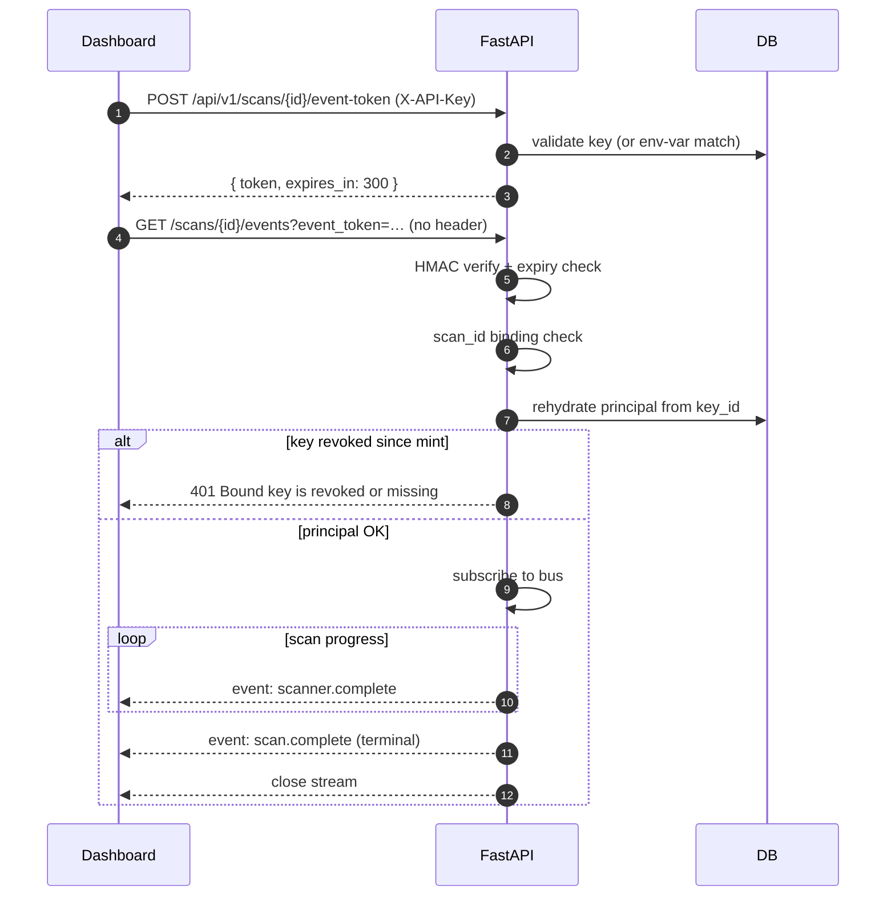

# SSE event tokens

Browsers cannot attach custom headers to an `EventSource`. Without
this mechanism the dashboard's live-progress stream would either:

- Punch a hole in `require_api_key` for `/events` (no), or
- Fall back to 2-second polling in any authenticated deployment (the
  v0.7.0 reality).

v0.9.0 closes that gap. The dashboard exchanges its `X-API-Key` for
a short-lived signed token and rides on `?event_token=...`.

<!-- toc -->

## Token format

```text
base64url( "<scan_id>|<key_id>|<expires_at>|<sig_b64>" )

where sig_b64 = base64url( HMAC_SHA256( secret, "<scan_id>|<key_id>|<expires_at>" ) )
```

- **scan_id** — the scan the token authorizes. The token works on
  *only* this scan's `/events` route; replaying it against scan B
  401s.
- **key_id** — the DB key id (`5a7c8f9eab`), the literal string
  `"env"` for the legacy env-var path, or `"dev"` for dev mode.
  Used to **rehydrate the principal at connect time**, so revoking a
  DB key invalidates outstanding tokens immediately — even before
  their TTL expires.
- **expires_at** — unix seconds. Default TTL is **300 seconds** (5
  minutes).
- **sig** — HMAC-SHA-256 over the body, base64url, no padding.

The signing secret is `SECURESCAN_EVENT_TOKEN_SECRET`. Required when
`SECURESCAN_AUTH_REQUIRED=1`. In dev mode the backend auto-generates
an ephemeral 32-byte secret on first use.

```admonish warning
**Set `SECURESCAN_EVENT_TOKEN_SECRET` explicitly in production.**
Without it, every backend restart picks a new ephemeral secret —
in-flight SSE tokens from the FE silently 401, the dashboard's live
progress goes blind, and the FE falls back to polling. The startup
hook will exit with code 2 if `AUTH_REQUIRED=1` and the secret is
unset (defense in depth).
```

## End-to-end flow



## Three layers of defense at verify time

The auth path is in
[`backend/securescan/auth.py::_authenticate_via_event_token`](https://github.com/Metbcy/securescan/blob/main/backend/securescan/auth.py).

1. **HMAC + expiry.** The `event_tokens.verify(...)` helper rejects
   forged or expired tokens. Constant-time comparison.
2. **Scan-id binding.** The `scan_id` baked into the token must
   match the one in the URL path. A token minted for scan A cannot
   be replayed against scan B.
3. **Principal rehydrate.** The bound `key_id` is looked up in the
   `api_keys` table; if the row is revoked or missing, the
   connection is refused — even if the token's HMAC and TTL are
   still valid. Revocation is immediate.

## Frontend rotation timeline

The FE rotates tokens at half-life and tries one re-mint on error
before falling back to polling.

```mermaid
gantt
    title SSE token rotation for an 8-minute scan
    dateFormat HH:mm:ss
    axisFormat %M:%S

    section Tokens
    token-1 (5m TTL)   :active, t1, 00:00:00, 5m
    token-2 (rotate at half-life) :t2, 00:02:30, 5m
    token-3 (rotate at half-life) :t3, 00:05:00, 5m
    token-4 (rotate at half-life) :t4, 00:07:30, 5m

    section EventSource
    open with token-1  :crit, e1, 00:00:00, 2m30s
    swap to token-2    :e2, 00:02:30, 2m30s
    swap to token-3    :e3, 00:05:00, 2m30s
    swap to token-4    :e4, 00:07:30, 1m
    scan.complete (close) :milestone, 00:08:00, 0s
```



The rotation is implemented in `frontend/src/app/scan/[id]/`:

- On `EventSource.onopen`, schedule a rotation timer at TTL / 2.
- On rotation: `POST /event-token`, then close the old `EventSource`,
  then open a new one with the fresh token. The order matters — the
  browser's auto-reconnect on the old `EventSource` would otherwise
  race with the new connection.
- On `EventSource.onerror`: try one re-mint; if that also errors,
  close `EventSource` and start polling `GET /scans/{id}` every 2s.

## Manually minting a token

```bash
$ curl -s -X POST -H "X-API-Key: $K" \
    http://127.0.0.1:8000/api/v1/scans/$SCAN_ID/event-token | jq .
{
  "token": "MGYxYTkzY2J8NWE3YzhmOWVhYnwxNzMwMjMwNTg1fGFi....",
  "expires_in": 300
}
```

The response includes `Cache-Control: no-store` so the token does
not stick in proxies or access logs longer than necessary.

Use it on the events stream:

```bash
$ TOKEN="MGYxYTkzY2J8NWE3YzhmOWVhYnwxNzMwMjMwNTg1..."
$ curl -N "http://127.0.0.1:8000/api/v1/scans/$SCAN_ID/events?event_token=$TOKEN"
event: scan.start
data: {"scan_types":["code"]}
...
```

A token bound to scan A replayed against scan B:

```bash
$ curl -i -N "http://127.0.0.1:8000/api/v1/scans/OTHER/events?event_token=$TOKEN"
HTTP/1.1 401 Unauthorized
{"detail":"Token does not match scan id"}
```

## Dev-mode tokens

When the system has no env-var key AND no DB keys (dev mode), the
mint endpoint still works — it issues a token bound to `key_id="dev"`.

The verifier accepts dev tokens **only while the system remains in
dev mode**. If the operator subsequently sets `SECURESCAN_API_KEY`
or creates a DB key, every outstanding dev-mode token immediately
401s with `Dev-mode token no longer valid (auth has been enabled)`.

This is by design. The alternative — keeping dev-mode tokens valid
forever — would let a stale browser tab bypass auth after the
operator hardens the deployment. Regression tests:
`test_sse.py::test_dev_mode_token_round_trips` and
`test_dev_mode_token_invalidated_when_auth_enabled`.

```admonish note title="Bug fix history"
v0.9.0 introduced this `"dev"` sentinel. An earlier draft minted
dev-mode tokens with `key_id="env"`, then verification rejected them
because no env-var was actually configured. Caught in integration;
fixed before the v0.9.0 ship. See the v0.9.0
[CHANGELOG entry](../reference/changelog.md#090---2026-04-29).
```

## Path-spoofing safety

The auth path checks `request.url.path` to decide whether the
`?event_token=` is honored:

```python
is_sse_route = (
    request.url.path.endswith("/events")
    and "/scans/" in request.url.path
)
```

`request.url.path` is the **post-routing** ASGI path that
FastAPI/Starlette already used to dispatch. A caller cannot lie
about being on the SSE route to win this check while actually
hitting a different handler — the path FastAPI sees is the path
that determines the handler, full stop.

In addition, the token's `scan_id` is compared against the path's
`scan_id`. So even within the SSE family, a token leaks only to its
own scan id.

## Token TTL trade-off

5 minutes is short enough that a leaked token (browser extension,
shared screenshot) is not a long-lived risk. It is long enough that
a normal scan completes inside one token. For long scans (multi-hour
nmap sweeps, ZAP active scans), the half-life rotation is the
mechanism — the FE just keeps re-minting.

If your operational profile demands a different TTL, the constant
is `TOKEN_TTL_SECONDS` in
[`backend/securescan/event_tokens.py`](https://github.com/Metbcy/securescan/blob/main/backend/securescan/event_tokens.py).
We do not currently expose it as an env var because no operator has
asked.

## What this is *not*

```admonish important title="Not a general-purpose bearer token"
Event tokens are scoped to a single scan's SSE route. They are not:

- General-purpose API auth (use the API key for anything else).
- Long-lived (5-minute TTL).
- Cookie-able (they ride in the query string by design).
- A delegation mechanism (they bind to the minting key's id).

If you need browser auth for the rest of the API, use the API key
directly via `X-API-Key`. SSE is the special case because of the
`EventSource` browser-API limitation, not a deliberate auth design.
```

## Source

- Token mint/verify:
  [`backend/securescan/event_tokens.py`](https://github.com/Metbcy/securescan/blob/main/backend/securescan/event_tokens.py).
- Mint endpoint + auth integration:
  [`backend/securescan/api/scans.py`](https://github.com/Metbcy/securescan/blob/main/backend/securescan/api/scans.py)
  (`create_event_token`).
- Verify path:
  [`backend/securescan/auth.py::_authenticate_via_event_token`](https://github.com/Metbcy/securescan/blob/main/backend/securescan/auth.py).

## Next

- [Real-time scan progress](../dashboard/realtime.md) — what the SSE stream actually delivers.
- [API keys](./api-keys.md) — the issuer of the keys these tokens bind to.
- [Production checklist](./production-checklist.md) — `SECURESCAN_EVENT_TOKEN_SECRET` is on it.
