# Contributing

SecureScan is an MIT-licensed open-source project. Contributions are
welcome — particularly bug reports with reproducers, scanner
integrations, and documentation fixes.

<!-- toc -->

## Bug reports

Open an issue at
[github.com/Metbcy/securescan/issues](https://github.com/Metbcy/securescan/issues)
with:

1. SecureScan version (`securescan --version` or the container tag).
2. The command / API call you ran.
3. Expected vs. actual behavior.
4. A minimal reproducer if you can — even a small repo that exhibits
   the bug helps enormously.
5. Relevant log lines from `/tmp/securescan-backend.log` (the
   `securescan.scan` and `securescan.request` loggers).

## Pull requests

```mermaid
flowchart LR
  Fork[Fork the repo] --> Branch[git checkout -b your-fix]
  Branch --> Code[Make changes]
  Code --> Test[pytest tests/ -v]
  Test --> Lint[Lint + typecheck]
  Lint --> Push[Push to your fork]
  Push --> PR[Open PR against main]
  PR --> CI[CI runs]
  CI --> Review[Code review]
  Review --> Merge[Squash merge]
```



### 1. Set up a dev environment

```bash
git clone https://github.com/Metbcy/securescan
cd securescan/backend
python3 -m venv venv && source venv/bin/activate
pip install -e ".[dev]"
pip install semgrep bandit safety pip-licenses checkov   # for tests that exercise scanners
```

For frontend changes:

```bash
cd ../frontend
npm install
npm run dev   # http://localhost:3000
```

### 2. Run the tests

```bash
cd backend
pytest tests/ -v
```

The test suite is comprehensive — 863 tests on v0.9.0. Most of them
run in seconds; a few that exercise real scanner subprocesses are
slower. Skip the slow tier with `pytest -m "not slow"`.

For the frontend:

```bash
cd frontend
npm run lint
npx tsc --noEmit
npm run build
```

### 3. Lint + typecheck

```bash
cd backend
ruff check .          # linter
ruff format --check . # formatter
mypy securescan/      # type check
```

### 4. Add a changelog entry

Append a bullet under `## [Unreleased]` in `CHANGELOG.md`. Match the
existing style: short, present-tense, scoped. Reference the PR
number when known.

### 5. Open the PR

- Title starting with `feat:`, `fix:`, `docs:`, etc. (Conventional
  Commits — used to drive the changelog and the GitHub Action's
  default commit messages).
- Description: what changed, why, and what you tested.
- Link the issue if there is one.

CI runs automatically on pull_request:
[`.github/workflows/securescan.yml`](https://github.com/Metbcy/securescan/blob/main/.github/workflows/securescan.yml).

### 6. Address review

Direct, specific feedback. Address every comment; if you disagree,
say so with reasoning. Reviewers will resolve threads they're
satisfied with.

### 7. Merge

Maintainers squash-merge to keep history linear. The squash commit's
title becomes the changelog reference.

## Adding a scanner

A new scanner is a Python class that subclasses `BaseScanner`:

```python
# backend/securescan/scanners/your_scanner.py
from .base import BaseScanner, ScanType
from ..models import Finding, Severity

class YourScanner(BaseScanner):
    name = "your-tool"
    scan_type = ScanType.CODE
    binary = "your-tool"
    install_hint = "pip install your-tool"

    async def run(self, target_path: str) -> list[Finding]:
        result = await self._run_subprocess(
            ["your-tool", "--json", target_path]
        )
        return [self._parse(item) for item in result.json()]
```

Then register it in
[`backend/securescan/scanners/__init__.py`](https://github.com/Metbcy/securescan/blob/main/backend/securescan/scanners/__init__.py):

```python
from .your_scanner import YourScanner

ALL_SCANNERS = [
    ...existing...,
    YourScanner(),
]
```

Add tests in `backend/tests/scanners/test_your_scanner.py`. Use the
existing scanners as templates; the test file pattern is to mock
the subprocess call and assert the parser handles representative
output.

Update [Supported scanners](./scanning/supported-scanners.md) with
the new entry.

## Documentation

This documentation site lives in `docs/`. To preview locally:

```bash
cd docs
mdbook serve --port 3001    # avoids the frontend's port 3000
# Open http://localhost:3001
```

Edits hot-reload. The site builds in CI on every push to `main` and
deploys to GitHub Pages — see
[`.github/workflows/docs.yml`](https://github.com/Metbcy/securescan/blob/main/.github/workflows/docs.yml).

Style guidelines:

- **Concrete examples on every page.** Don't say "you can configure
  X" without showing X being configured.
- **Cross-link aggressively.** Make navigation easy.
- **No marketing fluff.** SecureScan is an internal tool, not a
  SaaS sell-page. Tone is precise + practical.
- **Code blocks have language tags.** ` ```bash`, ` ```python`,
  ` ```yaml`, etc.
- **Use admonitions sparingly.** `note`, `warning`, `tip`,
  `important`. Don't sprinkle them.
- **Cite the source code** when explaining behavior, e.g., "see
  `backend/securescan/scanners/zap_scanner.py`".

## Frontend changes

Read
[`DESIGN.md`](https://github.com/Metbcy/securescan/blob/main/DESIGN.md)
first. The frontend has hard rules:

- OKLCH tokens only — no hardcoded hex colors.
- Single-hue severity ramp — no neon traffic-light.
- Tables, not card grids, for finding-dense surfaces.
- shadcn/ui primitives where available.

Every PR that touches `frontend/`:

1. `pnpm tsc --noEmit` passes.
2. `pnpm build` passes.
3. Visual review against `DESIGN.md`.
4. Both themes (dark + light) render without missing tokens.
5. No banned-list items introduced.

## Release flow

Maintainers cut releases by:

1. Bumping `backend/pyproject.toml` version.
2. Moving the `[Unreleased]` changelog section to a new `[<version>]` section.
3. Pushing a tag matching `v[0-9]+.[0-9]+.[0-9]+`.

See [Release process](./reference/release-process.md) for the
full pipeline.

## Code of conduct

Be respectful, be specific, prefer evidence over preference. The
project tone in PRs and issues mirrors the product tone in the
codebase: calm, direct, opinionated, kind to the next maintainer.

## License

MIT — see
[`LICENSE`](https://github.com/Metbcy/securescan/blob/main/LICENSE).
By contributing, you agree your contributions are licensed under
the same terms.

## Source

- Repo: [github.com/Metbcy/securescan](https://github.com/Metbcy/securescan).
- Issues: [github.com/Metbcy/securescan/issues](https://github.com/Metbcy/securescan/issues).
- Pull requests: [github.com/Metbcy/securescan/pulls](https://github.com/Metbcy/securescan/pulls).
