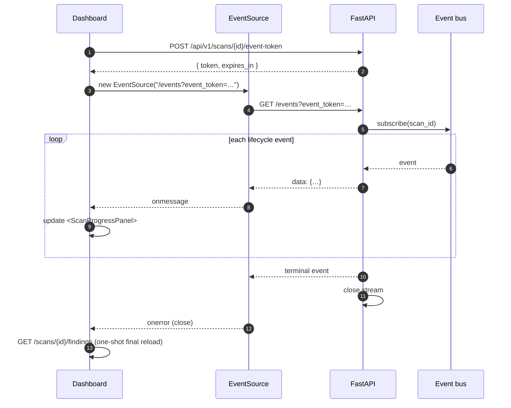
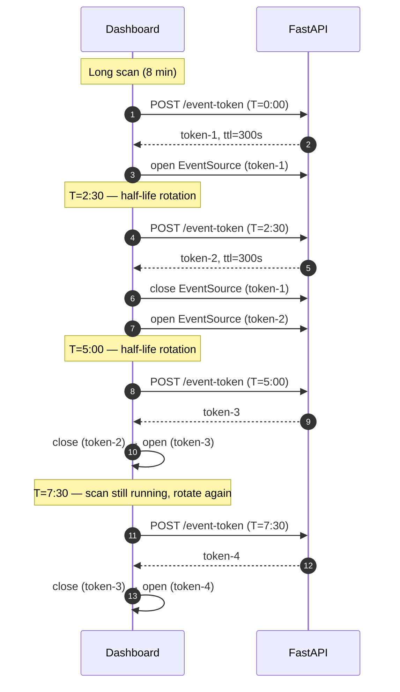

# Real-time scan progress

While a scan is `running` (or `pending`), the dashboard's scan-detail
page does not poll. It opens a Server-Sent Events stream and renders
each scanner's lifecycle as it happens — `queued → running → complete
/ failed / skipped`.

Introduced in v0.7.0; the SSE-with-auth path was finalized in v0.9.0
([SSE event tokens](../auth/event-tokens.md)).

<!-- toc -->

## Endpoint

```text
GET /api/v1/scans/{scan_id}/events
Accept: text/event-stream

# Authenticated deployments:
GET /api/v1/scans/{scan_id}/events?event_token=<token>
```

```admonish note
Browsers cannot send `X-API-Key` (or any custom header) on an
`EventSource`. For authenticated deployments, the FE first calls
`POST /api/v1/scans/{id}/event-token` to mint a short-lived token,
then opens `EventSource` with `?event_token=...`. See
[SSE event tokens](../auth/event-tokens.md).
```

## Events emitted

| Event              | When                                                            | Payload (selected fields)                              |
| ------------------ | --------------------------------------------------------------- | ------------------------------------------------------ |
| `scan.start`       | Orchestrator begins.                                            | `{scan_types}`                                         |
| `scanner.start`    | A specific scanner is about to run.                             | `{name}`                                               |
| `scanner.complete` | A scanner returned successfully.                                | `{name, duration_s, findings_count}`                   |
| `scanner.skipped`  | A scanner is unavailable.                                       | `{name, reason, install_hint}`                         |
| `scanner.failed`   | A scanner crashed.                                              | `{name, error}` (error truncated to 200 chars)         |
| `scan.complete`    | All scanners returned (or were skipped); status is `completed`. | `{findings_count, risk_score, scanners_run, scanners_skipped}` |
| `scan.failed`      | Orchestrator-level failure.                                     | `{error}`                                              |
| `scan.cancelled`   | `POST /scans/{id}/cancel` succeeded.                            | (no fields)                                            |

`scan.complete`, `scan.failed`, and `scan.cancelled` are **terminal**
events — the server closes the stream after emitting one. Source:
`TERMINAL` constant in
[`backend/securescan/events.py`](https://github.com/Metbcy/securescan/blob/main/backend/securescan/events.py).

## On the wire

```bash
curl -N "http://127.0.0.1:8000/api/v1/scans/$SCAN_ID/events"
```

```text
: keepalive

event: scan.start
data: {"scan_types":["code","dependency"]}

event: scanner.start
data: {"name":"semgrep"}

event: scanner.complete
data: {"name":"semgrep","duration_s":4.31,"findings_count":7}

event: scanner.start
data: {"name":"bandit"}

event: scanner.complete
data: {"name":"bandit","duration_s":1.04,"findings_count":2}

event: scan.complete
data: {"findings_count":9,"risk_score":24.0,"scanners_run":["semgrep","bandit"],"scanners_skipped":[]}
```

15-second keepalive comments (`: keepalive\n\n`) keep idle proxies
from killing the connection.

## Replay buffer

A late subscriber — e.g. a tab refresh mid-scan — gets a 200-event
**replay buffer** so the dashboard can reconstruct the full state
even though it missed the early events. The buffer is retained for
30 seconds after a terminal event, then dropped.

Terminal events (`scan.complete` / `scan.failed` / `scan.cancelled`)
are **never** dropped on subscriber backpressure. If the buffer is
full, the oldest non-terminal event is evicted.

## Frontend wiring



The component is `<ScanProgressPanel>` in
[`frontend/src/app/scan/[id]/`](https://github.com/Metbcy/securescan/tree/main/frontend/src/app/scan).
While `status` is `running` or `pending` it renders one row per
scanner with state dots (`queued | running | complete | failed |
skipped`) and updates findings counts as they come in. On
`scan.complete` it triggers a one-shot
`GET /api/v1/scans/{id}/findings` for the final state.

```admonish tip title="Findings are NOT live"
The SSE stream carries lifecycle events (counts, durations, status
flips), not the findings themselves. Re-fetching findings on
`scan.complete` keeps the wire small and the rendering predictable.
```

## Token rotation timeline

For authenticated deployments, event tokens are valid for 5 minutes.
The frontend rotates at half-life (~2.5 minutes) and tries one
re-mint on error before falling back to status polling.



If a rotation fails (the API returned 401 because the underlying key
was just revoked), the FE tries one re-mint, then closes the SSE
and falls back to `GET /api/v1/scans/{id}` polling every 2 seconds —
matching the v0.6.1 status-only path.

See [SSE event tokens](../auth/event-tokens.md) for the token format
and verification.

## Fallback to polling

`EventSource` has no API surface for headers, but it does have one for
basic auth — except basic auth doesn't apply to `X-API-Key` either.
So in v0.7.0, the dashboard's behavior was:

- Unauthenticated: open SSE.
- Authenticated: skip SSE, poll `GET /scans/{id}` every 2 seconds.

v0.9.0 closes that gap with event tokens. Polling is now reserved for
the *fallback* path:

- `EventSource` errors out → close SSE → poll status.
- Token mint fails twice → close SSE → poll status.

Polling never fetches findings during a running scan; the v0.6.1 fix
moved findings to a load-on-mount-and-on-status-flip pattern.

## Deployment notes

```admonish warning title="Single-worker constraint"
The event bus is an **in-process module-level singleton**. A scan
that lands on uvicorn worker A and an SSE subscriber on worker B
will never see each other. Run `--workers 1`.

Multi-process pubsub (Redis backplane) is on the roadmap. To scale
horizontally today, run multiple separate single-worker instances
behind a sticky-session load balancer keyed on `scan_id`. See
[Single-worker constraint](../deployment/single-worker.md).
```

## Source code

- Endpoint: `GET /api/v1/scans/{id}/events` in
  [`backend/securescan/api/scans.py`](https://github.com/Metbcy/securescan/blob/main/backend/securescan/api/scans.py).
- Event bus: [`backend/securescan/events.py`](https://github.com/Metbcy/securescan/blob/main/backend/securescan/events.py).
- Token mint endpoint: `POST /api/v1/scans/{id}/event-token` (same file).
- Token logic: [`backend/securescan/event_tokens.py`](https://github.com/Metbcy/securescan/blob/main/backend/securescan/event_tokens.py).
- Frontend wiring: `frontend/src/app/scan/[id]/`.

## Next

- [SSE event tokens](../auth/event-tokens.md) — auth on the SSE stream.
- [Webhooks](./webhooks.md) — out-of-process delivery of the same events.
- [Notifications](./notifications.md) — durable record of completed scans.
