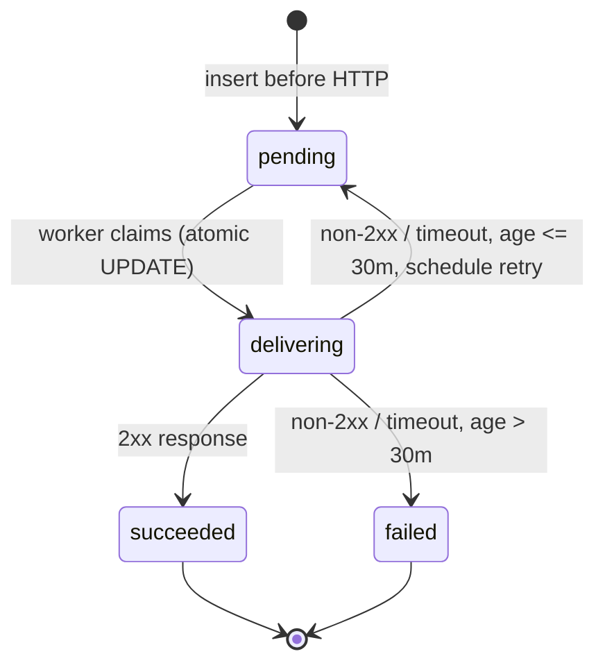

# Webhooks

Outbound HMAC-signed deliveries to your incident server, Slack,
Discord, or any HTTP receiver. Introduced in v0.9.0; durability is
the headline feature — every delivery is persisted to SQLite **before**
the HTTP call, so a backend restart resumes pending retries.

<!-- toc -->

## Quick start

Create a subscription:

```bash
curl -X POST http://127.0.0.1:8000/api/v1/webhooks \
  -H "X-API-Key: $ADMIN_KEY" \
  -H 'Content-Type: application/json' \
  -d '{
    "name": "ops-pager",
    "url": "https://hooks.example.com/securescan",
    "event_filter": ["scan.complete", "scan.failed", "scanner.failed"]
  }'
```

Response (the secret is returned **once**):

```json
{
  "id": "ddc22f0a-3a8f-4f1c-86e9-2b4b4ab0a8e0",
  "name": "ops-pager",
  "url": "https://hooks.example.com/securescan",
  "event_filter": ["scan.complete","scan.failed","scanner.failed"],
  "enabled": true,
  "created_at": "2026-04-29T20:00:00",
  "secret": "Hk8wQpz8QH4...32-chars..."
}
```

```admonish important
Save the `secret` immediately. Subsequent reads strip it; rotating
means delete + recreate. Use it to verify HMAC signatures on the
receiver side (see below).
```

Fire a synthetic test event right away:

```bash
curl -X POST http://127.0.0.1:8000/api/v1/webhooks/$WID/test \
  -H "X-API-Key: $ADMIN_KEY"
```

The synthetic event flows through **the exact same dispatcher path**
as a real one — same retry, same signature contract — so a green test
proves the receiver wiring end-to-end.

## What gets delivered

Per-delivery, the receiver gets:

```text
POST <your-url>
Content-Type: application/json
User-Agent: SecureScan-Webhook/0.9
X-SecureScan-Event: scan.complete
X-SecureScan-Webhook-Id: ddc22f0a-3a8f-4f1c-86e9-2b4b4ab0a8e0
X-SecureScan-Signature: t=1730230285,v1=8d3f0a7c...

{"event":"scan.complete","data":{"scan_id":"...","findings_count":3,...},"delivered_at":"..."}
```

For `hooks.slack.com` and `discord.com/api/webhooks` URLs, the body is
**reshaped** to the receiver's expected format (Slack blocks, Discord
embed). Generic JSON otherwise. See [Slack/Discord shape](#slackdiscord-detection)
below.

The full payload schema for every event lives in
[Webhook payloads](../api/webhook-payloads.md).

## Signature verification

The signature is over the literal request body bytes, prefixed with
the timestamp:

```text
v1 = HEX( HMAC_SHA256( secret, f"{t}." + raw_body ) )
```

```admonish warning title="Sign the literal bytes"
The dispatcher serializes the body with
`json.dumps(payload, separators=(",", ":"))` — whitespace-free, key
order preserved. **Sign the bytes you receive on the wire, not a
re-parsed/re-serialized JSON object.** If you parse, mutate, then
re-serialize before signing on the receiver side, the signatures
will not match.

Reject requests where `t` is more than 5 minutes old to defeat
replays.
```

### Python

```python
import hmac, hashlib

def verify(secret: str, header: str, raw_body: bytes) -> bool:
    """
    header is request.headers['X-SecureScan-Signature'],
    e.g. "t=1730230285,v1=8d3f0a7c...".
    """
    parts = dict(p.split("=", 1) for p in header.split(","))
    expected = hmac.new(
        secret.encode(),
        f"{parts['t']}.".encode() + raw_body,
        hashlib.sha256,
    ).hexdigest()
    return hmac.compare_digest(expected, parts["v1"])
```

A FastAPI receiver:

```python
from fastapi import FastAPI, Header, HTTPException, Request
import time

app = FastAPI()
SECRET = "Hk8wQpz8QH4...32-chars..."

@app.post("/securescan")
async def receive(
    request: Request,
    x_securescan_signature: str = Header(...),
    x_securescan_event: str = Header(...),
):
    raw_body = await request.body()
    parts = dict(p.split("=", 1) for p in x_securescan_signature.split(","))
    ts = int(parts["t"])
    if abs(time.time() - ts) > 300:
        raise HTTPException(401, "stale signature")
    if not verify(SECRET, x_securescan_signature, raw_body):
        raise HTTPException(401, "bad signature")

    payload = (await request.json())  # safe AFTER signature verify
    print(f"event={x_securescan_event} data={payload['data']}")
    return {"ok": True}
```

### Node.js

```javascript
import crypto from "node:crypto";

export function verify(secret, header, rawBody) {
  const parts = Object.fromEntries(
    header.split(",").map((p) => {
      const [k, v] = p.split("=");
      return [k, v];
    }),
  );
  const expected = crypto
    .createHmac("sha256", secret)
    .update(`${parts.t}.`)
    .update(rawBody)        // rawBody MUST be a Buffer
    .digest("hex");
  return crypto.timingSafeEqual(
    Buffer.from(expected, "hex"),
    Buffer.from(parts.v1, "hex"),
  );
}
```

Express receiver (note `express.raw` to keep the body bytes intact):

```javascript
import express from "express";
const app = express();
const SECRET = process.env.SECURESCAN_SECRET;

app.post(
  "/securescan",
  express.raw({ type: "application/json" }),
  (req, res) => {
    const sig = req.header("X-SecureScan-Signature");
    if (!verify(SECRET, sig, req.body)) return res.sendStatus(401);

    const payload = JSON.parse(req.body.toString("utf8"));
    console.log(req.header("X-SecureScan-Event"), payload.data);
    res.json({ ok: true });
  },
);
```

### Go

```go
package main

import (
    "crypto/hmac"
    "crypto/sha256"
    "encoding/hex"
    "io"
    "net/http"
    "strings"
    "time"
)

const secret = "Hk8wQpz8QH4...32-chars..."

func verify(header string, body []byte) bool {
    parts := map[string]string{}
    for _, p := range strings.Split(header, ",") {
        kv := strings.SplitN(p, "=", 2)
        if len(kv) == 2 {
            parts[kv[0]] = kv[1]
        }
    }
    mac := hmac.New(sha256.New, []byte(secret))
    mac.Write([]byte(parts["t"] + "."))
    mac.Write(body)
    expected := hex.EncodeToString(mac.Sum(nil))
    return hmac.Equal([]byte(expected), []byte(parts["v1"]))
}

func handler(w http.ResponseWriter, r *http.Request) {
    body, _ := io.ReadAll(r.Body)
    if !verify(r.Header.Get("X-SecureScan-Signature"), body) {
        http.Error(w, "bad signature", http.StatusUnauthorized)
        return
    }
    // Optional: reject stale timestamps to defeat replays.
    _ = time.Now
    w.WriteHeader(http.StatusOK)
}

func main() {
    http.HandleFunc("/securescan", handler)
    http.ListenAndServe(":8080", nil)
}
```

## Retry & state machine

Every delivery is persisted as a `webhook_deliveries` row **before**
the HTTP call. On any non-2xx (or transport error), the row's
`next_attempt_at` is set with full-jitter exponential backoff capped
at 5 minutes; max delivery age is 30 minutes — past that, the row is
marked `failed`.



```admonish important title="At-least-once delivery"
Receivers MUST be idempotent. The retry policy is at-least-once.
Use the `(t, v1)` pair plus the event-specific `data` (e.g.
`scan_id`) to dedupe. A duplicate scan-complete is a no-op for a
correct receiver.
```

```admonish note title="4xx is also retried"
The dispatcher retries 4xx responses too — a misconfigured receiver
that returns 401 for a few seconds while it loads its keys should
not lose deliveries within the 30-minute window.
```

### FIFO ordering per webhook

Deliveries for the *same* webhook id are processed in `created_at`
order. Two layers ensure this:

1. **In-process guard.** A per-webhook set
   (`_inflight_per_webhook`) skips any pending row whose webhook is
   already inflight; the next poll tick picks it up once the prior
   delivery finishes.
2. **Atomic claim.** `mark_delivery_delivering` runs an
   `UPDATE ... WHERE status='pending'` with a rowcount check; a
   second worker that races for the same row bails.

Different webhooks dispatch concurrently. Ordering is per-webhook,
not global.

### Crash recovery

On startup the dispatcher resets stale `delivering` rows back to
`pending` (left behind by a crash mid-delivery). Combined with the
"persist before HTTP" rule, a backend restart resumes any in-flight
retries cleanly.

Source:
[`backend/securescan/webhook_dispatcher.py`](https://github.com/Metbcy/securescan/blob/main/backend/securescan/webhook_dispatcher.py).

## Slack / Discord detection

The URL is matched against two prefixes:

```text
https://hooks.slack.com/services/...           → Slack-shape body
https://discord.com/api/webhooks/...           → Discord-shape body
(anything else)                                → generic SecureScan envelope
```

The reshaper lives in
[`backend/securescan/webhook_formatters.py`](https://github.com/Metbcy/securescan/blob/main/backend/securescan/webhook_formatters.py).

```admonish important title="Slack and Discord don't verify HMAC"
Slack and Discord webhook URLs are *unauthenticated* — anyone with
the URL can post. The HMAC headers are still sent (so you can route
through a proxy and verify there), but the receiver itself does not.
Treat the Slack/Discord URL itself as the secret. Don't share it.
```

See [Webhook payloads → Slack/Discord shape](../api/webhook-payloads.md#slack-shape)
for the exact body each provider receives.

## CRUD endpoints

All require the `admin` scope.

| Method   | Path                                 | Description                                                                 |
| -------- | ------------------------------------ | --------------------------------------------------------------------------- |
| `POST`   | `/api/v1/webhooks`                   | Create. **Returns secret once.**                                            |
| `GET`    | `/api/v1/webhooks`                   | List. No secrets.                                                           |
| `GET`    | `/api/v1/webhooks/{id}`              | Fetch one. No secret.                                                       |
| `PATCH`  | `/api/v1/webhooks/{id}`              | Edit `name` / `url` / `event_filter` / `enabled`. **Cannot rotate secret.** |
| `DELETE` | `/api/v1/webhooks/{id}`              | Cascades all deliveries.                                                    |
| `GET`    | `/api/v1/webhooks/{id}/deliveries`   | Last 100 delivery rows, newest first. Status, attempt, response code.       |
| `POST`   | `/api/v1/webhooks/{id}/test`         | Enqueue a `webhook.test` event. Returns 202 + `delivery_id`.                |

Source:
[`backend/securescan/api/webhooks.py`](https://github.com/Metbcy/securescan/blob/main/backend/securescan/api/webhooks.py).

```admonish warning title="Read-only access NOT provided"
Webhooks can leak finding data, and an attacker with write access
could redirect events to a sink they control. The `read` scope does
NOT see webhooks; only `admin` does. The `/settings/webhooks`
dashboard page is the only intended consumer.
```

## In the dashboard

`/settings/webhooks`:

```text
PageHeader: Webhooks · [+ New webhook]

Table
  ● enabled  ops-pager           hooks.example.com/securescan   3 events    Last: 2m ago [Test] [⋮]
  ● enabled  team-slack          hooks.slack.com/services/...   1 event     Last: 1h ago [Test] [⋮]
  ○ disabled audit-archive       https://archive...             4 events    Last: never  [Test] [⋮]

Click a row to expand:
  Delivery log (auto-refreshes every 5s)
    ● succeeded  scan.complete  delivery_id  204  attempt 1  T-2m
    ● succeeded  webhook.test   delivery_id  204  attempt 1  T-3m
    ● failed     scan.complete  delivery_id  500  attempt 6  T-1h
```

## Source code

- API: [`backend/securescan/api/webhooks.py`](https://github.com/Metbcy/securescan/blob/main/backend/securescan/api/webhooks.py)
- Dispatcher: [`backend/securescan/webhook_dispatcher.py`](https://github.com/Metbcy/securescan/blob/main/backend/securescan/webhook_dispatcher.py)
- Slack/Discord shaper: [`backend/securescan/webhook_formatters.py`](https://github.com/Metbcy/securescan/blob/main/backend/securescan/webhook_formatters.py)

## Next

- [Webhook payloads](../api/webhook-payloads.md) — every event's full payload schema.
- [Notifications](./notifications.md) — the in-app counterpart.
- [Real-time scan progress](./realtime.md) — same events on the SSE stream.
