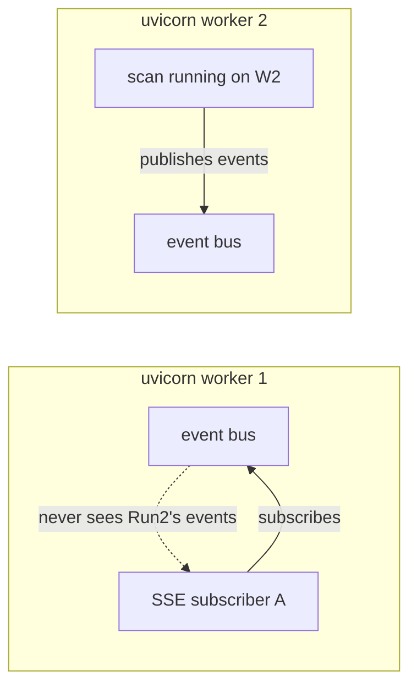
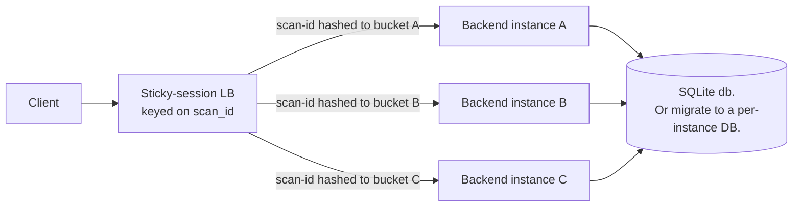

# Single-worker constraint

SecureScan must run with `--workers 1` on uvicorn. This page explains
**why**, what breaks if you ignore it, and how to scale horizontally
when you outgrow one worker.

<!-- toc -->

## What's in-process

Two systems are module-level singletons that live inside the
uvicorn worker:

1. **The event bus** — the in-process pub/sub powering live
   scan-progress SSE. Each scan has subscribers (the dashboard tab,
   notification creator, webhook enqueuer); each scanner publishes
   lifecycle events to that bus.
   Source: [`backend/securescan/events.py`](https://github.com/Metbcy/securescan/blob/main/backend/securescan/events.py).
2. **The webhook dispatcher** — a long-lived asyncio task that
   polls the `webhook_deliveries` table, sends, retries, marks
   succeeded / failed.
   Source: [`backend/securescan/webhook_dispatcher.py`](https://github.com/Metbcy/securescan/blob/main/backend/securescan/webhook_dispatcher.py).

Both are bound to **the worker that booted them**. There is no shared
memory, no cross-process pubsub, no leader election.

## What breaks on `--workers 2+`



If a `POST /scans` lands on worker 2 and a `GET /scans/{id}/events`
lands on worker 1:

- Worker 2's bus gets every lifecycle event.
- Worker 1's bus gets nothing.
- The dashboard tab silently sees no progress events; the live
  panel hangs on `pending`.

The webhook dispatcher has a related failure: each worker runs its
own dispatcher task. They both poll the *same* `webhook_deliveries`
table. The atomic `mark_delivery_delivering` claim prevents
double-sending — but you've doubled the polling load and lost FIFO
per webhook (different workers might race, claim, and deliver out
of order). The system *appears* to work, but the v0.9.0 contract
is violated.

```admonish warning title="Run --workers 1"
The default uvicorn invocation in the bundled Docker entrypoint and
in `securescan serve` is `--workers 1`. Do not override it.
```

## Why not multi-process pubsub right now

A Redis backplane is on the v0.7.x+ roadmap. We chose to ship the
in-process bus first because:

- It is simple — no external dependency, no failure mode where the
  bus can be down while the API is up.
- Single-worker is enough for the typical SecureScan deployment
  size (one team, dozens of scans per hour).
- Multi-process correctness for the webhook dispatcher requires
  more than just pubsub — it needs leader election or partitioned
  queue ownership to keep FIFO per webhook.

We will add a Redis-backed bus + a pubsub-friendly dispatcher when
real users hit the throughput ceiling. So far, nobody has.

## Scaling horizontally today

If you need more throughput than one worker can give:



Run **multiple separate backend deployments**, each with its own
single uvicorn worker. Put a **sticky load balancer** in front,
keyed on `scan_id` (or path-prefixed: scans starting with `0a*` go
to instance A, etc).

Each scan's lifecycle (`POST /scans` → `GET /events` → SSE → webhook
dispatch) lives on the same instance, so the in-process bus
behaves correctly.

```admonish important
This pattern handles the SSE / webhook problem but introduces a
new one: the SQLite DB is per-instance. If you want a unified
finding history across instances, use a shared SQLite (NFS — not
recommended for write-heavy load) or migrate to PostgreSQL
(SecureScan's `aiosqlite` layer is the only thing that depends on
SQLite, and it has been intentionally kept thin to ease a future
swap).
```

A common compromise: scale the **scanning** workload horizontally,
keep a single instance for the **dashboard** (which is read-mostly).
The dashboard reads via the API; you don't have to share the DB to
share findings — you can query each scanner instance and merge.

## Read endpoints scale fine

Read endpoints (`GET /scans`, `GET /findings`, etc.) do not depend
on the in-process bus. A multi-instance read-replica pattern with
its own SQLite (rsync'd from the writer) works for read-heavy
auditing workloads.

## What to do *not* do

- **Do NOT run `uvicorn ... --workers 4`** behind a single load
  balancer. SSE breaks silently.
- **Do NOT run two `uvicorn` processes pointing at the same
  SQLite DB** without sticky routing. The webhook dispatchers will
  fight (correctness preserved by the atomic claim, but FIFO
  ordering broken).
- **Do NOT use `gunicorn -w 4` as a wrapper.** Same fail mode.

## How to verify your deploy is single-worker

```bash
$ docker exec securescan-backend ps aux | grep uvicorn
root       7  1.2  ...  uvicorn securescan.api:app --host 0.0.0.0 --port 8000 --workers 1
```

Or hit `/api/v1/dashboard/status` from two different terminals and
confirm both responses come from the same `X-Request-ID`-emitting
process (the `request_id` is per-request, but the underlying PID in
the structured log is the same — you can grep `securescan.request`
in the log to confirm).

## Roadmap

| Item                                                  | Status              |
| ----------------------------------------------------- | ------------------- |
| In-process event bus (single worker)                  | ✅ shipped v0.7.0   |
| In-process webhook dispatcher                         | ✅ shipped v0.9.0   |
| Redis pubsub backplane (cross-worker bus)             | Roadmap             |
| Distributed queue + leader election for dispatcher    | Roadmap             |
| PostgreSQL-backed `webhook_deliveries`                | Roadmap (after Redis) |

When the roadmap items land, this page will become "horizontal
scaling guide" rather than "constraint."

## Source

- Event bus: [`backend/securescan/events.py`](https://github.com/Metbcy/securescan/blob/main/backend/securescan/events.py)
- Webhook dispatcher: [`backend/securescan/webhook_dispatcher.py`](https://github.com/Metbcy/securescan/blob/main/backend/securescan/webhook_dispatcher.py)
- Bus subscription on the SSE route: `event_stream` in
  [`backend/securescan/api/scans.py`](https://github.com/Metbcy/securescan/blob/main/backend/securescan/api/scans.py)

## Next

- [Real-time scan progress](../dashboard/realtime.md) — the consumer of the in-process bus.
- [Webhooks](../dashboard/webhooks.md) — the dispatcher's job.
- [Production checklist](./production-checklist.md) — `--workers 1` is on it.
