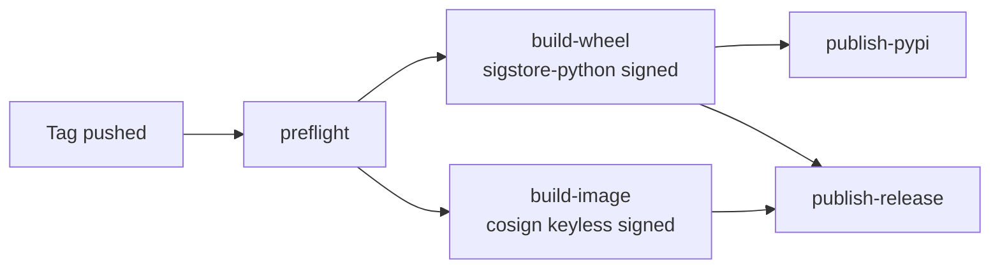

# Release process

How a SecureScan release happens — from the tag push to the published,
signed artifacts. The full pipeline is in
[`.github/workflows/release.yml`](https://github.com/Metbcy/securescan/blob/main/.github/workflows/release.yml).

<!-- toc -->

## Trigger

Releases are **strictly tag-triggered**:

```yaml
on:
  push:
    tags:
      - 'v[0-9]+.[0-9]+.[0-9]+'
```

Pre-release tags (`v0.9.0-rc1`) and arbitrary `v*` tags are
deliberately excluded. Manual `workflow_dispatch` is also
intentionally NOT offered — its OIDC identity is branch-based, not
tag-based, which would break the cosign / sigstore verification
commands published in the release notes (those identities are
pinned to `refs/tags/<tag>`).

```admonish important title="Tag-only is on purpose"
The cosign verification command in
[Verifying signed artifacts](../deployment/verifying-artifacts.md)
includes:

​    --certificate-identity 'https://github.com/Metbcy/securescan/.github/workflows/release.yml@refs/tags/v0.11.0'

If the workflow could be re-run via `workflow_dispatch`, that
identity would have a different ref and the verification would
fail. Tag-trigger only ensures the published verification commands
always work against the published artifacts.
```

## Pipeline



Five jobs:

### 1. Preflight (cheap, fast-fail)

Verifies:

- The pushed tag matches `pyproject.toml`'s `version`.
- `CHANGELOG.md` has a section for that version.

Fails the whole release before spending time on builds if the metadata is out of sync.

### 2. Build-wheel

- Builds the wheel + sdist on a single Linux runner (pure-Python; no
  native code, no per-platform matrix needed).
- Signs each artifact with `sigstore-python` keyless via the
  workflow's OIDC identity. Bundle is the
  `*.sigstore.json` file alongside the artifact.
- Uploads the artifacts and bundles as workflow outputs for the
  PyPI + release jobs.

### 3. Build-image

- Builds the multi-arch container (amd64 + arm64) and pushes to
  `ghcr.io/metbcy/securescan` with the immutable per-release tag
  `v<version>` (e.g. `v0.11.0`). `:latest` is **not** published — pin
  to a tag.
- Signs **by digest** with `cosign` keyless (Sigstore via OIDC). The
  signature attests the `(digest, identity)` pair, not the tag, so
  re-pointing a tag never changes what was signed.

### 4. Publish-pypi (OIDC Trusted Publishers)

- Uploads the signed wheel + sdist to PyPI via
  [OIDC Trusted Publishers](https://docs.pypi.org/trusted-publishers/).
  PyPI verifies the GitHub Actions OIDC token signed for this
  `repo + workflow file + environment` combination and mints a
  short-lived upload token; **no `PYPI_TOKEN` secret is required**.
- Runs in the `pypi` GitHub Environment so PyPI's Trusted Publisher
  configuration can scope the trust narrowly.
- `skip-existing: true` makes re-runs of the same tag idempotent.
- Note: PyPI does not host the `*.sigstore.json` bundles. They are
  attached to the GitHub Release instead.

One-time setup (configure a pending publisher on PyPI) is documented
in [`docs/PUBLISHING.md`](https://github.com/Metbcy/securescan/blob/main/docs/PUBLISHING.md).

### 5. Publish-release

- Extracts the matching `CHANGELOG.md` section.
- Appends signature-verification instructions (the literal commands
  from [Verifying signed artifacts](../deployment/verifying-artifacts.md)
  with `<tag>` and `<version>` substituted).
- Creates the GitHub Release with the signed wheel, sdist, sigstore
  bundles, and SBOM attached.

## What artifacts ship

Per release, the GitHub Release page hosts:

| Artifact                                      | Format / signing                            |
| --------------------------------------------- | ------------------------------------------- |
| `securescan-<version>-py3-none-any.whl`       | wheel (sigstore-python signed)              |
| `securescan-<version>-py3-none-any.whl.sigstore.json` | sigstore bundle for the wheel       |
| `securescan-<version>.tar.gz`                 | sdist (sigstore-python signed)              |
| `securescan-<version>.tar.gz.sigstore.json`   | sigstore bundle for the sdist               |

The container image is published separately to GHCR:

```text
ghcr.io/metbcy/securescan:v<version>     (e.g. v0.11.0 — immutable, signed)
```

`:latest` is **not** published. Always pin to a `vX.Y.Z` tag (or, in
production, by digest — see
[Verifying signed artifacts](../deployment/verifying-artifacts.md#pinning-in-production)).

Cosign signature attestations are stored alongside the image in GHCR
(use `cosign verify` to check, see
[Verifying signed artifacts](../deployment/verifying-artifacts.md)).

## Concurrency

```yaml
concurrency:
  group: release-${{ github.ref }}
  cancel-in-progress: true
```

A second push of the same tag (rare; e.g. force-push after a fixup)
**cancels** the in-flight run rather than racing it. Different tags
release concurrently.

## Permissions

```yaml
permissions:
  contents: write       # create release, upload assets
  id-token: write       # cosign + sigstore-python keyless OIDC
  packages: write       # ghcr.io push
```

The `id-token: write` permission is what makes keyless signing work —
the runner's OIDC token is exchanged with Sigstore's Fulcio for a
short-lived signing certificate. No long-lived key material is
involved.

## Manual reruns

If a release job fails (transient network error, PyPI rate limit),
re-run the failed job from the GitHub Actions UI on the original
tag-push event. The same OIDC identity is re-used — verification
commands remain valid.

Do **not**:

- Push a new tag for the same version. SemVer says tags are
  immutable; treating them otherwise will break consumer pins.
- Manually run the workflow via `workflow_dispatch`. Disabled on
  purpose — see [Trigger](#trigger).

## Pre-flight checklist (for the maintainer)

When cutting a release:

1. [ ] Bump `backend/pyproject.toml` version.
2. [ ] Move the `[Unreleased]` section in `CHANGELOG.md` to a new
       `[<version>] - <date>` section.
3. [ ] Update the version-compare links at the bottom of `CHANGELOG.md`.
4. [ ] Update `README.md`'s "What's new in vX.Y.Z" callout (optional
       for patch releases).
5. [ ] Commit + merge to `main`.
6. [ ] Tag: `git tag v<version>` and `git push --tags`.

The release workflow handles everything else.

## How to verify a release as a downstream user

End-to-end:

```bash
# 1. Wheel
pip download securescan==0.11.0 --no-deps -d ./out
gh release download v0.11.0 --repo Metbcy/securescan \
  --pattern 'securescan-0.11.0-py3-none-any.whl.sigstore.json' --dir ./out

pip install sigstore
sigstore verify identity \
  --cert-identity 'https://github.com/Metbcy/securescan/.github/workflows/release.yml@refs/tags/v0.11.0' \
  --cert-oidc-issuer 'https://token.actions.githubusercontent.com' \
  --bundle ./out/securescan-0.11.0-py3-none-any.whl.sigstore.json \
  ./out/securescan-0.11.0-py3-none-any.whl

# 2. Container image
cosign verify ghcr.io/metbcy/securescan:v0.11.0 \
  --certificate-identity 'https://github.com/Metbcy/securescan/.github/workflows/release.yml@refs/tags/v0.11.0' \
  --certificate-oidc-issuer 'https://token.actions.githubusercontent.com'
```

Both should succeed. See [Verifying signed artifacts](../deployment/verifying-artifacts.md)
for failure-mode troubleshooting.

## Source

- Workflow: [`.github/workflows/release.yml`](https://github.com/Metbcy/securescan/blob/main/.github/workflows/release.yml).
- Container build: [`.github/workflows/container.yml`](https://github.com/Metbcy/securescan/blob/main/.github/workflows/container.yml).
- Default test run: [`.github/workflows/securescan.yml`](https://github.com/Metbcy/securescan/blob/main/.github/workflows/securescan.yml).

## Next

- [Release cadence](./release-cadence.md) — when to expect new minor / patch / major releases.
- [Verifying signed artifacts](../deployment/verifying-artifacts.md) — the consumer side.
- [Changelog](./changelog.md) — the per-release feature record.
- [Contributing](../contributing.md) — the path from PR to release.
