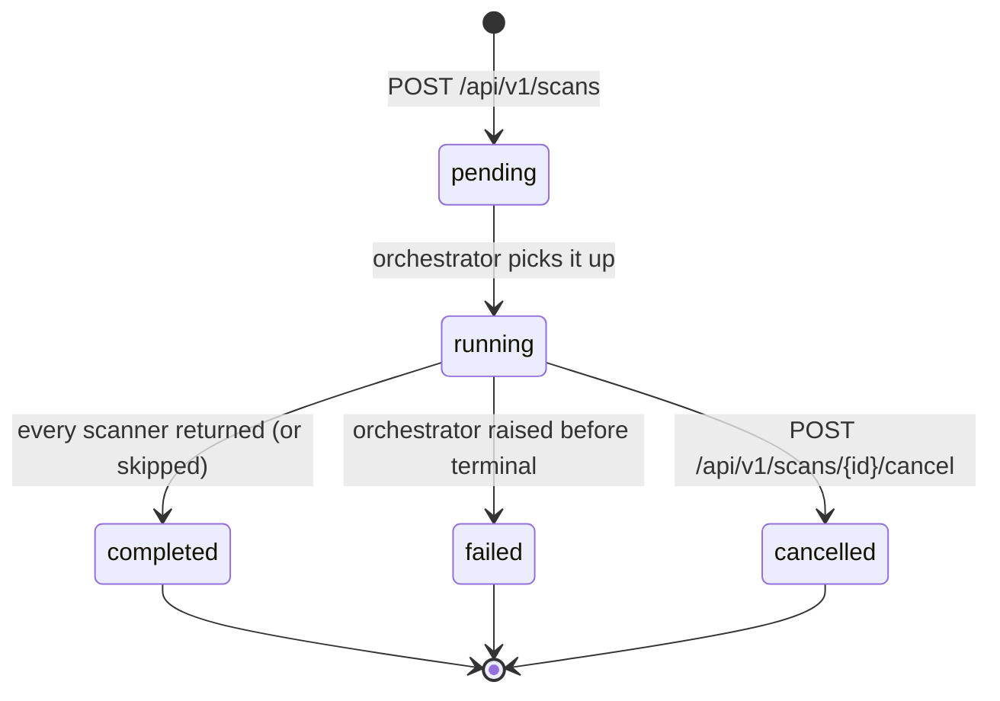

# How scans work

A scan is an orchestrated sweep of one or more scanner subprocesses
against a target — almost always a directory in the local filesystem,
sometimes a URL (DAST) or hostname (network). The result is a row in
the `scans` table plus N rows in `findings`, normalized into a
single shape regardless of which scanner produced them.

<!-- toc -->

## Lifecycle



Every transition emits a structured log line on the
`securescan.scan` logger AND publishes to the in-process event bus
([Real-time scan progress](../dashboard/realtime.md)). On the bus,
each scanner has its own sub-lifecycle:

```text
scan.start
  scanner.start          # one per scanner that will run
  scanner.complete       # OR
  scanner.skipped        # tool not on PATH; payload includes install_hint
  scanner.failed         # tool crashed; error truncated to 200 chars
scan.complete            # OR
scan.failed              # OR
scan.cancelled
```

Source: see `_log_scan_event` in
[`backend/securescan/api/scans.py`](https://github.com/Metbcy/securescan/blob/main/backend/securescan/api/scans.py).

## What runs, in what order

`POST /api/v1/scans` accepts:

```json
{
  "target_path": "/abs/path/to/repo",
  "scan_types": ["code", "dependency"],
  "target_url": null,
  "target_host": null
}
```

The orchestrator looks up scanners by `scan_type`
(see [Supported scanners](./supported-scanners.md)) and runs them
in registry order. Each scanner is a Python class with an `async run()`
that shells out to the underlying tool, parses stdout, and returns a
list of `Finding` objects.

`scanners_run` and `scanners_skipped` are persisted on the scan row,
so a `404` for a scanner whose binary is not installed never silently
disappears — the dashboard shows it under "Skipped (N)" with the
install hint surfaced from the scanner's `install_hint` property.

## Cancellation

```bash
curl -X POST -H "X-API-Key: $K" \
  http://127.0.0.1:8000/api/v1/scans/$SCAN_ID/cancel
```

- Returns 200 with `status: cancelled` if the scan was `running` or `pending`.
- Returns 409 if the scan is already `completed` / `failed` / `cancelled`.
- Returns 404 for an unknown id.

The orchestrator's asyncio task is cancelled, which propagates
`CancelledError` into the currently-running subprocess wrapper and
asks it to terminate.

## Deletion

```bash
curl -X DELETE -H "X-API-Key: $K" \
  http://127.0.0.1:8000/api/v1/scans/$SCAN_ID
```

- Returns 204 on success — findings are cascade-deleted.
- Returns 409 if the scan is `running` or `pending` (cancel first).
- Returns 404 for an unknown id.

```admonish important
Deleting a scan does **not** delete triage verdicts (`finding_states`)
or per-finding comments. Those are keyed on the cross-scan
fingerprint, so they reactivate when a matching finding reappears in
a later scan. Cleared on purpose: a "false positive" verdict outlives
the scan that produced the original finding. See
[Triage workflow](./triage.md).
```

## Determinism

Two scans of the same git ref produce the same findings, in the same
order, with the same fingerprints. This is foundational — without it,
the v0.2.0 PR-comment upsert would behave like "post a new comment
every push", and SARIF re-uploads to GitHub's Security tab would look
like a flood of new alerts.

The relevant guarantees are:

1. Findings are sorted canonically:
   `severity_rank desc, scanner, rule_id, file_path, line, title`.
2. AI enrichment is auto-disabled when `CI=true` is set
   (it is non-deterministic). Pass `--ai` to override.
3. Wall-clock timestamps are excluded from byte-identity-sensitive
   payload sections. `SECURESCAN_FAKE_NOW` pins the one time-derived
   field that exists.
4. SARIF rule lists are deduplicated and ordered.

See [Findings & severity](./findings-severity.md) for the fingerprint
construction and [Architecture overview](../architecture.md) for the
end-to-end determinism contract.

## CLI mode (no backend)

`securescan scan ./your-repo` runs the same orchestrator without
involving the backend or DB. The output goes to stdout in whatever
format you ask for:

```bash
securescan scan ./your-repo \
  --type code --type dependency \
  --output sarif --output-file results.sarif

securescan scan ./your-repo \
  --type code \
  --output json --output-file findings.json
```

CLI mode is what `securescan diff` uses internally — it scans both
sides of the diff and classifies findings into `NEW` / `FIXED` /
`UNCHANGED`. See [CLI commands](../cli/commands.md).

## Failure modes

| Symptom                                              | Likely cause                                                   | Where to look                                                         |
| ---------------------------------------------------- | -------------------------------------------------------------- | --------------------------------------------------------------------- |
| Scan stuck in `running` past the longest scanner     | A subprocess hung; the orchestrator awaits its asyncio future. | `tail /tmp/securescan-backend.log`; cancel the scan; check `nmap`/ZAP |
| All scanners come back as `skipped`                  | None of the underlying CLIs are on `PATH`.                     | `securescan status`                                                   |
| `scan.failed` with `error: ...`                      | Orchestrator-level exception (DB write failed, target invalid) | Backend log `securescan.scan` logger.                                 |
| Specific scanner repeatedly `scanner.failed`         | Tool present but crashed on input. `error` field has details.  | Re-run the tool by hand on the same target.                           |

```admonish tip title="Watching a live scan from the terminal"
`tail -f /tmp/securescan-backend.log | grep securescan.scan` shows
the scan-lifecycle line for every event. The same data is on the
SSE stream at `/api/v1/scans/{id}/events` — use whichever fits your
debugging surface.
```

## Next

- [Scan types](./scan-types.md) — what each `scan_type` covers.
- [Supported scanners](./supported-scanners.md) — what each tool finds.
- [Findings & severity](./findings-severity.md) — the finding shape.
- [Suppression](./suppression.md) — three ways to silence a finding.
