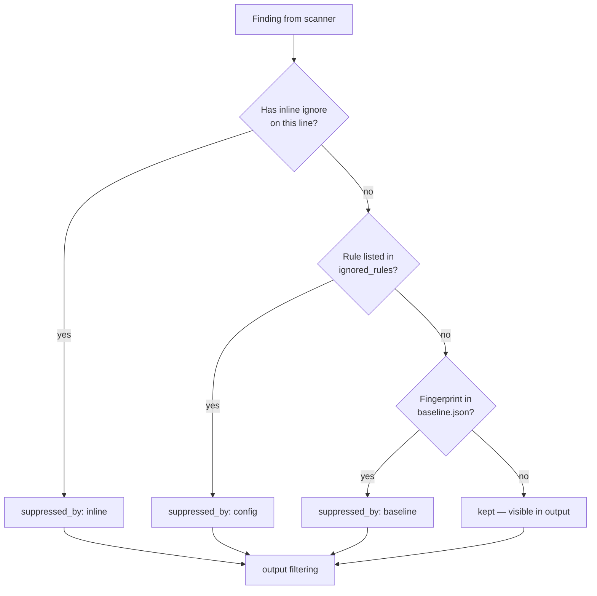

# Suppression

Three independent suppression mechanisms, with a fixed precedence:

> **inline > config > baseline**

The most-local mechanism wins; an inline comment defeats a config
rule, a config rule defeats a baseline entry. Each mechanism stamps
`metadata.suppressed_by` on the finding so the audit trail records
which path silenced it.

<!-- toc -->

## 1. Inline ignore comments

Place a comment on the finding's line, or the line above:

```python
data = eval(payload)  # securescan: ignore python.lang.security.audit.eval-detected

# securescan: ignore-next-line python.lang.security.audit.eval-detected
result = eval(other_payload)
```

Recognized comment styles: `#`, `//`, `--`. Multiple rule IDs are
comma-separated. `*` is a wildcard.

```javascript
// securescan: ignore-next-line javascript.lang.security.detect-eval, javascript.lang.security.detect-non-literal-regex
const fn = new Function(userCode);
```

```sql
-- securescan: ignore *  (wildcard — silences EVERY rule on this line)
SELECT * FROM users WHERE id = '${user_id}';
```

When this mechanism applies, `metadata.suppressed_by = "inline"`.

```admonish tip title="One-click inline ignores"
The `Metbcy/securescan@v1` GitHub Action with `pr-mode: inline,
inline-suggestions: true` posts each finding with a one-click
`\`\`\`suggestion` block adding the `# securescan: ignore RULE-ID`
comment above the line. Reviewers can apply it with the GitHub UI's
"Commit suggestion" button. See [GitHub Action](../cli/github-action.md).
```

## 2. Config-driven rules (`.securescan.yml`)

Repo-wide rule list. Best for rules that fire too often to silence
inline.

```yaml
# .securescan.yml at the repo root
ignored_rules:
  - python.lang.security.audit.dynamic-django-attribute
  - B106  # bandit: hardcoded password (we use a vault)
  - python.django.security.audit.csrf-exempt-without-csrf-token
```

The config file is auto-detected: `securescan` walks up from the
target directory until it finds `.securescan.yml` or hits a `.git/`
boundary. To validate:

```bash
$ securescan config validate
.securescan.yml: OK
  scan_types: code, dependency
  ignored_rules: 3
  severity_overrides: 2
```

Validation catches typos in severity values, missing rule-pack
paths, and `ignored_rules` ↔ `severity_overrides` collisions before
they bite at scan time.

When this mechanism applies, `metadata.suppressed_by = "config"`.

### Severity overrides (related)

Not strictly suppression, but adjacent: `severity_overrides` rewrites
a rule's severity post-scan, preserving the original on
`metadata.original_severity`:

```yaml
severity_overrides:
  python.lang.security.audit.dangerous-system-call: medium
  some.noisy.rule: low
```

The dashboard renders `severity (was: high)` so reviewers know the
override was applied. See [Findings & severity](./findings-severity.md).

## 3. Baseline (legacy findings)

Adopt-on-an-existing-codebase mechanism. Snapshot the current set of
findings; subsequent scans suppress everything in the snapshot.

```bash
# Once, when adopting SecureScan:
securescan baseline   # writes .securescan/baseline.json (deterministic, git-friendly)
git add .securescan/baseline.json
git commit -m "chore: SecureScan baseline"
```

```bash
# Every PR / CI run:
securescan diff . --base-ref main --head-ref HEAD \
  --baseline .securescan/baseline.json
```

```admonish note
The baseline file is canonicalized and byte-deterministic: no
timestamps, relative target_path, sorted finding entries. Two
identical scans produce two identical baseline files, so it diffs
cleanly in code review.
```

When this mechanism applies, `metadata.suppressed_by = "baseline"`.

### Refreshing the baseline

When findings get fixed, refresh:

```bash
securescan baseline                                # overwrites .securescan/baseline.json

# What disappeared since the last baseline?
securescan compare .securescan/baseline.json
```

The `compare` subcommand reports `DISAPPEARED` findings — your
remediation drift. Useful at the end of a sprint to confirm the
work landed.

## Precedence in detail



The "winner" is the most-local applicable mechanism. If a finding is
both inline-ignored AND in the baseline, `suppressed_by = "inline"`.

## What gets hidden

By default:

| Surface                        | Suppressed shown? | How to override                                        |
| ------------------------------ | :---------------: | ------------------------------------------------------ |
| `securescan diff` PR comment   | No                | `--show-suppressed`                                    |
| SARIF (`--output sarif`)       | No                | `--show-suppressed`                                    |
| CSV (`--output csv`)           | No                | `--show-suppressed`                                    |
| `securescan diff` on TTY       | Yes (with prefix) | `--no-suppress` to disable suppression entirely        |
| Dashboard findings table       | No                | Toggle: "Show suppressed findings" (per-page)          |
| `--fail-on-severity` counting  | No                | Suppressed findings never gate the build by design     |

`--fail-on-severity` is intentionally **only counting kept findings**.
A baseline-suppressed critical does not turn a clean PR red — that is
the whole point of baselining.

## Audit: what was suppressed?

When you want to see the breakdown:

```bash
$ securescan diff . --base-ref main --head-ref HEAD --show-suppressed
[NEW]
  [HIGH]   semgrep   backend/api.py:42       Use of eval()
  [MEDIUM] secrets   config.yml:5            AWS access key

[SUPPRESSED:inline]
  [HIGH]   semgrep   tests/fixtures/eval.py:3   intentional eval in fixture

[SUPPRESSED:config]
  [LOW]    semgrep   migrations/0001.py:12      ignored_rules: noisy-rule

[SUPPRESSED:baseline]
  [HIGH]   bandit    backend/legacy.py:88       (legacy finding)

Summary
  NEW:                  2
  Suppressed:           3 (inline=1, config=1, baseline=1)
  fail-on-severity:     none
```

The PR comment summary table also includes a
"Suppressed: N (inline=I, config=C, baseline=B)" row when
`--show-suppressed` is set so reviewers can audit without re-running.

## Disabling suppression entirely (kill switch)

Sometimes you want every finding visible — review pass, audit, etc:

```bash
securescan diff . --base-ref main --head-ref HEAD --no-suppress
```

`--no-suppress` ignores inline comments, config rules, AND the
baseline. Useful but rarely the right CI default.

## Picking the right mechanism

```admonish tip title="Which mechanism for which case?"
- **One bad fixture line** → inline comment.
- **A scanner rule that fires hundreds of times** → `ignored_rules`.
- **Adopting SecureScan on an old codebase** → `securescan baseline`.
- **A rule that fires "right" on production code but is wrong here** → `severity_overrides` to lower its weight first; `ignored_rules` only if it is genuinely wrong.
- **An entire scan family that does not apply to your repo** → just don't pass that `--type`. Suppression is for *findings*, not *scanners*.
```

## Next

- [Triage workflow](./triage.md) — durable verdicts beyond suppression.
- [Findings & severity](./findings-severity.md) — the underlying model.
- [GitHub Action](../cli/github-action.md) — `inline-suggestions: true` for one-click ignores.
