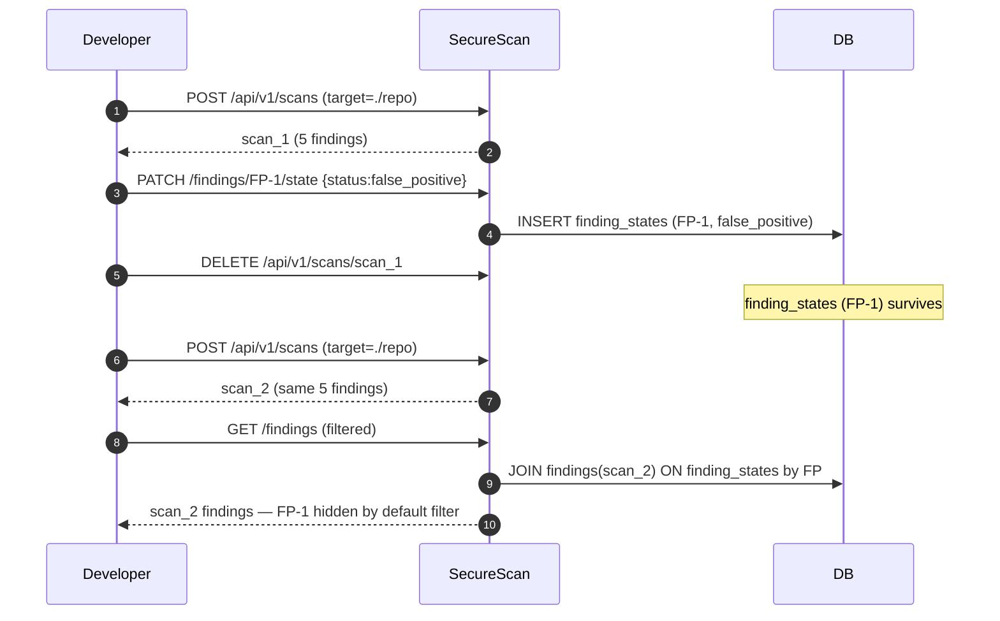

# Triage workflow

Triage is **how you record what you decided about a finding**, durably,
across rescans of the same target. Introduced in v0.7.0, it sits one
layer above [Suppression](./suppression.md): suppression silences a
finding, triage *records the human verdict on a finding* — including
whether it was actually fixed, accepted as risk, or won't be fixed.

<!-- toc -->

## Triage statuses

```text
new            (default — no verdict recorded)
triaged        (acknowledged; under investigation)
false_positive (scanner is wrong)
accepted_risk  (real, but accepted by the team)
fixed          (the underlying code was changed; verify on rescan)
wont_fix       (real, but out of scope to fix)
```

The dashboard's findings table renders a colored status pill in the
"Status" column. The default filter hides
`{false_positive, accepted_risk, wont_fix}` — those are decisions, the
table no longer needs to draw attention to them.

```admonish note title="Why fixed is NOT default-hidden"
`fixed` findings stay in the table on purpose: if a "fixed" finding
reappears on a later rescan (regression), you want to *see* it. The
dashboard renders the row with strikethrough + accent-green pill so
the regression signal is loud, not silent.
```

## Scope: per-fingerprint, not per-scan

Triage state is keyed on the cross-scan
[fingerprint](./findings-severity.md#fingerprints--cross-scan-identity)
— **not** the scan id. Three consequences:

1. **A verdict survives every later scan of the same target.** Mark a
   finding `false_positive` once; the next scan, and the one after,
   keep that verdict.
2. **A verdict survives `DELETE /scans/{id}`.** The triage row stays;
   it reactivates when a matching fingerprint appears again.
3. **A "fixed" finding shows up loud on regression.** If it
   reappears in a later scan, the row is rendered with the `fixed`
   pill + strikethrough — the team can see at a glance that something
   came back.

This is by design. Triage state and per-finding comments are an audit
trail, not scan metadata.

## Setting a verdict

```bash
FP="9d2f3a1b8c4e5f6a..."

curl -X PATCH \
  "http://127.0.0.1:8000/api/v1/findings/$FP/state" \
  -H "X-API-Key: $K" \
  -H 'Content-Type: application/json' \
  -d '{
    "status": "false_positive",
    "note": "intentional eval in test fixture",
    "updated_by": "alice"
  }'
```

Response:

```json
{
  "fingerprint": "9d2f3a1b8c4e5f6a...",
  "status": "false_positive",
  "note": "intentional eval in test fixture",
  "updated_at": "2026-04-29T20:14:22.000000",
  "updated_by": "alice"
}
```

```admonish important
PATCH semantics here are **replace, not merge**. Omitting `note`
clears the prior note. Use the comments thread for incremental
remarks; reserve `note` for a one-line "why" on the verdict.
```

The endpoint requires the `write` scope — see
[Scopes](../auth/scopes.md). Source:
[`backend/securescan/api/triage.py`](https://github.com/Metbcy/securescan/blob/main/backend/securescan/api/triage.py).

## Comments

Each finding has a per-fingerprint comments thread. Like the verdict,
comments are durable across scans.

```bash
# List comments
curl "http://127.0.0.1:8000/api/v1/findings/$FP/comments" \
  -H "X-API-Key: $K"

# Add a comment
curl -X POST "http://127.0.0.1:8000/api/v1/findings/$FP/comments" \
  -H "X-API-Key: $K" \
  -H 'Content-Type: application/json' \
  -d '{"text":"Reviewed with security team — green-lit.","author":"bob"}'

# Delete a comment by id
curl -X DELETE \
  "http://127.0.0.1:8000/api/v1/findings/$FP/comments/c-12ab" \
  -H "X-API-Key: $K"
```

Comments require the `write` scope (`add` and `delete`); listing
requires `read`.

The dashboard renders the comments thread in the **expanded row**
panel, lazy-loaded the first time you open it. Add / delete are
inline.

## In the dashboard

The Scan Detail page's findings table:

- New **Status** column shows the pill (color-coded; `fixed` adds
  strikethrough + accent-green).
- Sticky filter bar has a **status filter chip strip** in addition
  to severity chips. Triage and suppression filters are independent
  and AND-combined.
- Default-hide set is `{false_positive, accepted_risk, wont_fix}` —
  toggle them via the filter to see them.
- Expand a row → **Triage panel** (status dropdown + note textarea)
  + **Comments panel** (lazy loaded; add / delete inline).

See [Dashboard tour](../dashboard/tour.md#scan-detail).

## Endpoints

| Method   | Path                                                      | Scope   | Notes                                              |
| -------- | --------------------------------------------------------- | :-----: | -------------------------------------------------- |
| `PATCH`  | `/api/v1/findings/{fingerprint}/state`                    | `write` | Set / replace verdict + note. Server stamps `updated_at`. |
| `GET`    | `/api/v1/findings/{fingerprint}/comments`                 | `read`  | Returns `[]` when no comments. ASC by `created_at`.       |
| `POST`   | `/api/v1/findings/{fingerprint}/comments`                 | `write` | 201 with the persisted row.                              |
| `DELETE` | `/api/v1/findings/{fingerprint}/comments/{comment_id}`    | `write` | 204 on success, 404 if id is unknown.                    |

The fingerprint is **not** validated against any current scan — it's
intentional that you can set state on a fingerprint that does not
correspond to any current finding. The state row reactivates when the
finding reappears.

## Workflow with rescans



A fix workflow:

```mermaid
sequenceDiagram
  autonumber
  participant Dev as Developer
  participant API as SecureScan
  Dev->>API: PATCH /findings/FP-2/state {status:fixed,note:"PR #42"}
  Note over Dev: ... time passes; rescan ...
  Dev->>API: POST /api/v1/scans
  API-->>Dev: scan_3 — FP-2 not present (truly fixed)
  Note over Dev: regression check passes
  Note over Dev: ... time passes; refactor ...
  Dev->>API: POST /api/v1/scans
  API-->>Dev: scan_4 — FP-2 present again
  Note over Dev: dashboard shows FP-2 with strikethrough fixed pill — regression signal
```

## CLI access

There is no first-class CLI for triage in v0.9.0; use `curl` or the
dashboard. A `securescan triage` subcommand is on the roadmap.

## Triage vs. suppression: when to use which

| Question                                                      | Mechanism                                              |
| ------------------------------------------------------------- | ------------------------------------------------------ |
| "Stop printing this finding in PR comments forever"           | [Suppression](./suppression.md) (`ignored_rules`)      |
| "I've reviewed this; record my decision"                      | Triage (`PATCH /findings/{fp}/state`)                  |
| "I want this finding gone but I want to know if it comes back"| Triage `fixed` (NOT default-hidden — regression loud)  |
| "Adopt SecureScan on an old codebase"                         | [Suppression](./suppression.md) (`securescan baseline`)|
| "Track who decided what, when"                                | Triage (`updated_by` + comments)                       |

In short: **suppression silences output, triage records decisions.**
You can use both — a finding can be triaged AND suppressed.

## Next

- [Findings & severity](./findings-severity.md) — the fingerprint that keys triage state.
- [Suppression](./suppression.md) — for output filtering, not decisions.
- [API endpoints](../api/endpoints.md) — full request/response shape.
